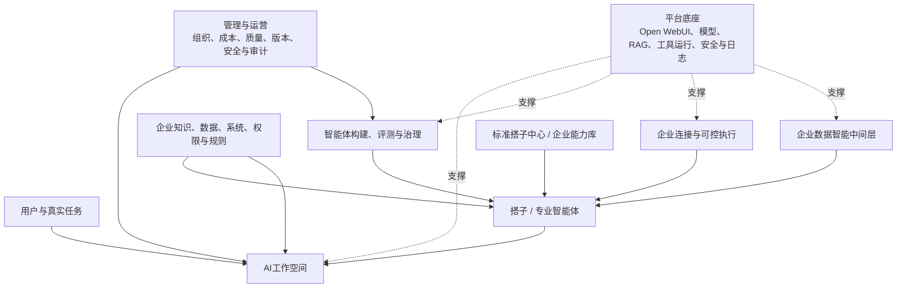

# 企业AI工作空间与专业智能体平台产品规划书

> 文档版本：V1.2  
> 文档状态：正式产品规划书  
> 更新日期：2026-07-22  
> 适用对象：投资人、平台底层开发负责人、产品负责人及项目相关负责人
>
> 文档用途：统一企业AI工作空间与专业智能体平台的战略定位、目标形态、产品架构、能力体系、版本路线和建设边界，作为后续产品设计、版本PRD、技术方案和研发排期的上位依据。

## 0. 一页结论

### 0.1 我们要做什么

本产品定位为：

> **以AI工作空间为真实任务入口，以搭子和专业智能体提供可复用专业能力，并支持企业结合自身知识、数据、系统、权限和业务流程，构建、运行、评测和持续运营专属智能能力的企业AI平台。**

产品不是单一聊天工具、知识库问答工具、内容生成工具或智能体市场，而是一套从真实任务进入、专业能力调用、企业环境结合，到能力持续构建、治理和运营的完整产品体系。

### 0.2 为什么值得做

企业使用AI的关键问题不是“有没有AI入口”，而是AI能否进入真实工作：

- 能否围绕客户、项目、课题、部门或持续任务组织资料、过程和成果；
- 能否让普通用户不从模型、Prompt和知识配置开始，而是直接调用专业能力；
- 能否让专业能力被构建、测试、评测、发布、升级和治理；
- 能否连接企业知识、数据、系统、权限和业务规则；
- 能否在授权和审计约束下参与协同、流程和执行；
- 能否把企业实践中可复用的方法沉淀为标准能力和企业能力资产。

因此，产品的长期目标是让AI从“会聊天”升级为“能在企业真实环境中完成任务、沉淀能力并持续优化”。

### 0.3 先做什么，长期做成什么

第一阶段先聚焦：

```text
AI工作空间
+ 基础搭子
+ 知识绑定
+ 笔记、文稿、PPT、报告等内容成果闭环
```

长期逐步升级为：

```text
企业专业智能体平台
= 工作空间
+ 搭子/专业智能体
+ 企业知识、数据、系统和权限
+ 构建、评测、治理和运营能力
```

这意味着当前不需要一次性建设全部企业连接、数据中间层、开放市场和复杂多智能体能力，但需要在V1的数据对象和底层接口上为后续能力预留正确关系。

### 0.4 产品发展路线

```text
Open WebUI部署与基础封装
→ AI工作空间与基础搭子
→ 标准搭子与专业办公
→ 专业智能体构建、评测与调优
→ 企业连接与可控执行
→ 企业数据智能中间层
→ 能力运营、企业能力库和搭子市场成熟
```

| 阶段   | 核心定位              | 关键结果                          |
| ---- | ----------------- | ----------------------------- |
| 建设起点 | Open WebUI部署与基础封装 | 建立模型、会话、知识库、RAG、权限和应用扩展基础     |
| V1   | AI工作空间与基础搭子       | 跑通资料、对话、笔记、搭子和成果生产闭环          |
| V1.5 | 标准搭子与专业办公         | 用户可以直接选择标准能力完成常规专业任务          |
| V2   | 专业智能体构建           | 平台能够构建、测试、评测和持续升级专业智能体        |
| V3   | 企业连接与执行           | 智能体能够进入企业系统、工具和流程，在授权下参与协同与执行 |
| V4   | 企业数据智能            | 智能体能够安全、正确、可解释地理解企业数据和真实业务状态  |
| V5   | 能力运营与生态成熟         | 标准能力、企业能力和搭子市场形成持续运营与复利       |

## 1. 为什么需要这个产品

### 1.1 企业AI应用存在的核心断层

通用大模型已经能够完成对话、写作和资料分析，但企业实际使用仍存在明显断层：

- 资料、对话、笔记和成果分散，AI无法围绕同一任务持续工作；
- 普通用户需要自行选择模型、编写Prompt和配置知识，使用门槛较高；
- 只依靠人设和知识库，难以稳定完成复杂专业任务；
- AI与企业系统、流程和数据脱节，无法理解真实业务状态并参与执行；
- 每个企业和项目反复从零配置，成熟行业知识和专业方法难以复用；
- 企业缺少统一构建、运行、评测、发布和治理智能体的平台。

产品需要逐步解决四个层次的问题：

1. AI能否围绕真实任务持续工作；
2. 普通用户能否低门槛获得稳定的专业能力；
3. 专业能力能否被构建、测试、评测和升级；
4. AI能否进入企业知识、系统、数据和权限环境，形成可控的业务闭环。

### 1.2 为什么从AI工作空间切入

企业工作通常围绕一个客户、项目、课题、部门或持续任务展开。用户需要不断补充资料、追问、整理、修改和形成成果，而不是在一次会话中完成全部工作。

AI工作空间将以下内容组织在同一个持续任务环境中：

- 当前任务、目标和上下文；
- 文件、网页、文本和知识来源；
- AI对话与引用依据；
- 用户笔记与中间结论；
- 可调用的搭子和专业能力；
- 文稿、PPT、报告、图文等成果；
- 成员、权限、过程和历史版本。

工作空间不是简单的会话文件夹，而是AI参与企业真实工作的任务载体。它是产品进入用户日常工作的切入口，也是后续专业智能体、企业系统、企业数据和企业能力共同运行的载体。

### 1.3 为什么需要搭子与专业智能体

只有工作空间，用户仍然需要自行配置模型、Prompt、知识和输出方式。搭子把这些复杂能力封装成用户可以理解、选择和调用的产品形态。

搭子不是简单人设，而是专业智能体面向用户的表达。它可以从角色、Prompt、知识和模板开始，逐步增强Skill、工具、规则、评测和版本，最终形成可稳定复用的专业能力。

```text
基础搭子
→ 标准搭子
→ 增加专业知识、方法、Skill、工具和评测
→ 高成熟度专业智能体或数字专家
```

数字专家不是另一套技术对象，而是专业智能体达到较高成熟度后的市场表达。当前规划重点是先建立统一的专业智能体构建、运行和评测体系，再逐步形成更成熟的数字专家供给。

### 1.4 为什么最终要进入企业环境

工作空间、标准搭子和内容生产可以完成常规专业办公，但企业深度工作还需要真实环境：

- 企业知识让AI理解制度、产品、历史项目和专业规则；
- 企业系统和工具让AI查询状态、生成草稿、发起协同和参与执行；
- 企业数据让AI理解当前经营状态、指标变化和业务问题；
- 权限、人工确认和审计保证读取、判断和执行过程可控。

因此，AI工作空间是产品切入口，不是终点。长期目标是让专业智能体进入企业真实环境，形成能够理解企业、协同工作并持续升级的企业专属智能能力。

## 2. 我们要做的产品是什么

### 2.1 完整产品构成

| 产品组成      | 核心作用                                        |
| --------- | ------------------------------------------- |
| AI工作空间    | 承载客户、项目、课题和持续任务中的资料、过程、上下文和成果               |
| 搭子/专业智能体  | 以用户可理解的搭子形态提供专业能力，内部按专业智能体进行构建、评测和治理        |
| 企业知识与数据环境 | 让智能体理解企业资料、制度、指标、口径、业务状态和数据权限               |
| 企业连接与执行   | 让智能体在授权下连接IM、OA、业务系统、API、MCP、CLI工作流并参与协同和执行 |
| 构建、评测与治理  | 支持智能体配置、Skill、工具、版本、评测、审计、安全和持续调优           |
| 能力中心与市场   | 分发标准搭子、高成熟度数字专家和企业内部能力，形成复用和运营机制            |
| 管理与运营     | 管理组织、成员、权限、成本、质量、风险、使用效果和业务价值               |

工作空间回答“当前在做什么”；搭子和专业智能体回答“用什么能力完成”；企业环境回答“基于哪些真实知识、数据、系统和权限工作”；治理机制回答“过程是否可控、结果是否可信、能力是否可持续优化”。

### 2.2 目标客户与核心用户

产品主要面向希望统一使用并持续深化AI能力的企业和团队，特别是拥有较多专业资料、知识型任务，并计划连接企业系统和数据的组织。

| 用户角色 | 主要诉求 | 产品价值 |
| --- | --- | --- |
| 普通业务用户 | 基于资料完成分析、文稿、PPT、报告和日常任务 | 工作空间、基础搭子、标准搭子和成果生产 |
| 业务专家 | 把专业方法、知识和判断方式稳定复用 | 参与建设知识、Skill、模板、规则和评测 |
| 企业AI管理员 | 管理企业搭子、智能体、知识和发布范围 | 智能体构建、企业能力库和运营管理 |
| IT与数据负责人 | 安全连接企业系统和数据 | 连接、权限、指标语义、审计和风险控制 |
| 企业管理者 | 观察AI使用、质量、成本和业务效果 | 质量运营、能力复用和价值评估 |

### 2.3 产品价值

| 价值层次 | 用户和企业得到什么 | 对应能力 |
| --- | --- | --- |
| 任务价值 | 围绕资料持续工作并形成可采用成果 | 工作空间、来源、对话、笔记和成果生产 |
| 专业价值 | 不从Prompt开始，也能按专业方法完成任务 | 标准搭子、专业智能体、Skill和评测 |
| 企业价值 | AI能够理解企业环境并参与协同和执行 | 企业知识、企业连接、数据智能、权限和审计 |
| 资产价值 | 企业知识和专家方法形成可持续使用的能力资产 | 企业增强智能体、企业能力库和版本运营 |
| 平台价值 | 标准能力和企业能力可以持续构建、分发和运营 | 标准搭子中心、智能体构建、版本和质量运营 |

### 2.4 产品战略原则

- **工作空间是任务入口**：产品首先围绕真实任务、资料和成果组织AI能力；
- **搭子是用户产品形态**：用户选择的是能够完成任务的能力，而不是底层技术配置；
- **智能体是能力内核**：知识、Skill、工具、规则、评测和版本共同决定专业能力；
- **企业环境形成深度能力**：标准能力结合企业知识、系统、数据和权限后形成企业增强；
- **连接与执行必须可控**：企业系统连接需要授权、确认、日志、失败处理和审计；
- **数据智能必须中间层化**：AI使用数据必须经过指标语义、权限安全、查询控制、结果解释和审计观测；
- **FDE是深化机制**：FDE负责真实任务共创和持续调优，不构成独立产品线；
- **评测与版本保证质量**：成熟能力依靠专业搭建和评测，不假设项目记录能够自动生成智能体；
- **标准化与私有化并存**：企业私有内容受到保护，共性能力经过治理后推动平台复利。

### 2.5 产品边界

产品不以以下方向作为核心：

- 不做以模型数量为主要卖点的通用模型聚合器；
- 不做只有上传文档和知识问答的单一RAG产品；
- 不从一开始建设无边界的通用工作流和系统集成平台；
- 不把每个行业场景都开发成独立产品；
- 不依靠人设包装或自动蒸馏形成所谓专业专家；
- 不把企业私有数据、凭证和配置直接沉淀到公共市场；
- 不在评测、权属和治理机制尚未成立前开放无门槛第三方市场。

产品化边界建议按四类管理：

| 类型 | 内容 | 产品化原则 |
| --- | --- | --- |
| 标准产品 | 工作空间、基础搭子、知识、生成、权限、日志、基础运营 | 所有客户通用，纳入统一产品路线 |
| 标准能力配置 | Skill、模板、通用工具定义、标准搭子版本 | 通过产品配置完成，不修改核心代码 |
| 企业配置 | 企业知识、权限、连接、数据口径、私有评测 | 企业范围内复用，形成企业能力库 |
| 项目定制 | 特定客户流程、系统、规则和交付要求 | 需评估是否沉淀为通用配置或独立项目能力 |

## 3. 产品如何分阶段长成

### 3.1 版本规划原则

产品版本按照用户价值和平台能力逐步演进，不同时建设全部长期能力：

- 先通过工作空间验证AI能否进入真实任务并形成成果；
- 再通过标准搭子降低普通用户使用门槛；
- 通过智能体构建和评测形成专业能力；
- 通过企业连接让智能体进入真实系统和流程；
- 通过数据智能中间层让智能体理解企业业务状态；
- 最终形成标准能力、企业能力和版本持续运营体系。

Open WebUI是底层建设起点，FDE是企业深化机制，两者不单独作为面向客户的产品版本。

### 3.2 各阶段形成的产品结果

| 阶段 | 解决的问题 | 形成的产品结果 | 核心能力 |
| --- | --- | --- | --- |
| Open WebUI基础封装 | 缺少统一AI运行和扩展基础 | 企业AI平台底座 | 模型、会话、RAG、权限、工具运行和日志 |
| 工作空间与基础搭子 | AI无法围绕任务持续工作 | AI工作空间和第一条成果闭环 | 资料、来源、对话、笔记、搭子和成果 |
| 标准搭子 | 普通用户使用和配置门槛高 | 标准搭子中心初始形态 | 标准搭子、模板、试用、启用和反馈 |
| 专业智能体构建 | 通用能力专业深度和稳定性不足 | 专业能力供给与构建体系 | 专业知识、Skill、工具、规则、评测和版本 |
| 企业连接与数据 | 标准能力无法理解具体企业 | 企业增强智能体和企业专属能力 | 企业知识、系统、数据、权限、执行和审计 |
| 能力持续运营 | 能力难以稳定复用和升级 | 标准能力与企业能力运营体系 | 发布、认证、继承、升级、回滚和运营 |

### 3.3 版本总览

| 版本   | 核心定位        | 主要产品结果             | 与总体演进的关系       |
| ---- | ----------- | ------------------ | -------------- |
| V1   | AI工作空间与基础搭子 | 用户围绕资料和任务形成可采用成果   | 建立用户任务入口       |
| V1.5 | 标准搭子与专业办公   | 用户直接选择标准能力完成常规专业任务 | 建立标准能力供给       |
| V2   | 专业智能体构建     | 平台构建、测试、评测和升级专业智能体 | 建立专业能力生产体系     |
| V3   | 企业连接与执行     | 智能体进入企业系统、工具和流程    | 建立企业连接与可控执行能力  |
| V4   | 企业数据智能      | 智能体理解企业数据和业务状态     | 建立企业数据理解和运营中间层 |
| V5   | 能力运营与生态成熟   | 标准能力、企业能力和市场持续运营   | 形成完整能力复利体系     |

### 3.4 标准能力进入企业与平台复利

产品长期不是只服务单次企业项目，而是通过标准能力、企业增强和能力回流形成复利：

```text
平台建设标准搭子和专业智能体
→ 企业直接使用或选择能力基础
→ 结合企业知识、数据、系统和规则形成企业增强版本
→ 在真实业务中持续使用、评测和调优
→ 提炼经过验证的共性知识、方法、Skill、模板和工具规范
→ 去敏、确权、重构和独立评测
→ 升级已有标准能力或形成新的高成熟度专业能力
→ 持续丰富标准搭子中心和企业能力库
```

能够形成平台复利的是经过抽象和验证的行业知识、专业方法、Skill、模板、工具适配规范、评测标准和失败经验，不是客户原始数据、系统凭证和私有配置。

## 4. 当前第一阶段做什么

### 4.1 建设起点：Open WebUI部署与基础封装

产品首先部署Open WebUI，并由底层团队完成面向后续应用产品的基础封装：

- 模型接入、切换和基础路由；
- 会话、上下文和流式输出；
- 文件处理、知识库、RAG检索和来源引用；
- 基础用户、组织、角色和权限；
- 搭子人设和知识绑定所需的基础配置；
- 工具调用、运行记录和企业连接的扩展基础。

Open WebUI提供底层能力和扩展基础，不直接等于最终面向客户的应用产品。

### 4.2 V1：AI工作空间与基础搭子版

**版本目标：** 在Open WebUI底层能力之上，让用户围绕一组资料和一个持续任务，调用基础搭子形成第一条可采用成果闭环。

**核心功能：**

- 工作空间创建、列表、详情、成员和基础权限；
- 文件和文本来源上传、解析、预览和引用；
- 工作空间对话、模型切换和基于来源回答；
- 回答保存、笔记编辑和继续使用；
- 文稿、PPT、报告、图片或图文内容生成；
- 生成任务、成果保存、基础编辑衔接和导出；
- 基础搭子人设、Prompt、知识绑定、选择和工作空间使用；
- 个人和组织知识库基础绑定；
- 核心链路、成果采用、失败和成本记录。

**版本结果：** 用户可以独立完成资料、对话、笔记、搭子和成果链路，并持续回到同一工作空间。

### 4.3 V1最小闭环

```text
用户创建一个工作空间
→ 上传或接入一组资料
→ 选择一个基础搭子
→ 围绕资料持续对话和整理
→ 生成笔记、文稿或PPT
→ 保存、编辑、导出或继续复用
→ 记录用户是否采用和如何修改
```

### 4.4 当前阶段不提前建设

当前阶段不应提前重投入：

- 完整开放型搭子交易市场；
- 复杂多智能体自动协同；
- 企业全量系统连接；
- 企业全量数仓问数平台；
- 自动从项目记录蒸馏成熟智能体；
- 第三方创作者生态；
- 过早的行业全场景方案。

当前阶段需要做的是把V1闭环跑通，并在对象模型和底层接口上为搭子、Skill、企业连接、数据上下文和运行记录预留正确关系。

## 5. 完整产品能力架构

### 5.1 目标产品架构



**图1 企业AI工作空间与专业智能体平台战略架构全景**


### 5.2 AI工作空间

AI工作空间围绕客户、项目、课题或持续任务组织资料、知识、对话、笔记、搭子和生成成果，是普通用户进入产品和持续使用AI的主要入口。

工作空间需要支持：

- 空间创建、分类、成员和权限；
- 文件、网页、文本和知识库来源；
- 基于来源的对话、分析和引用；
- 笔记、中间结论和任务上下文保存；
- 基础搭子、标准搭子和专业智能体调用；
- 文稿、PPT、报告、图片或图文等成果生成；
- 成果保存、编辑、导出、分享和继续复用；
- 过程记录、历史版本和协同。

工作空间长期承担四类价值：

1. 用户完成真实任务的入口；
2. 专业智能体运行的上下文容器；
3. 企业知识、数据和系统能力的绑定场景；
4. 智能体效果观察、反馈采集和持续调优的验证环境。

### 5.3 搭子与专业智能体

搭子是专业智能体面向用户的产品表达。用户不需要先理解模型、RAG、MCP或复杂Agent架构，而是选择一个适合当前任务的专业能力开始工作。

搭子能力可以沿着以下层级增强：

```text
L1 角色提示型：角色、人设、Prompt和输出风格
L2 知识增强型：绑定通用或授权知识、模板和引用依据
L3 Skill任务型：具备固定输入输出、执行步骤和失败处理
L4 工具连接型：可调用MCP、插件、API、Webhook或CLI工作流
L5 企业增强型：绑定企业知识、数据、系统、权限和业务规则
L6 持续调优型：具备评测集、版本、反馈和质量运营机制
```

同一个搭子可以持续升级，不需要人为拆成多套并列对象。

### 5.4 标准搭子与数字专家

标准搭子面向多数用户和企业都存在的高频任务，用于降低模型、Prompt、知识和工具的配置门槛。

| 典型搭子    | 可以完成的工作          | 主要能力内容               |
| ------- | ---------------- | -------------------- |
| 资料整理搭子  | 阅读、归纳、对比和提取多份资料  | 文件理解、来源引用、摘要与结构化整理   |
| 研究分析搭子  | 围绕课题搜集信息、形成分析和结论 | 搜索、资料分析、研究框架和报告模板    |
| 文稿写作搭子  | 基于资料生成、修改和完善文稿   | 写作方法、内容模板、改写与审核Skill |
| PPT策划搭子 | 提炼汇报逻辑并形成PPT内容   | 叙事结构、页面大纲、内容生成和版式要求  |
| 会议整理搭子  | 整理纪要、结论、任务和后续安排  | 信息提取、任务识别和纪要模板       |
| 项目总结搭子  | 汇总项目资料、阶段进展和问题   | 项目归纳、风险清单、总结与汇报模板    |

数字专家是高成熟度专业智能体的市场表达，不是另一套技术对象。未来可能形成的方向包括产品规划专家、市场研究专家、企业经营分析专家、电商运营专家、合同与合规专家、制造质量专家等。具体方向根据真实需求、专业资源、可评测程度和市场复用价值逐步建设。

### 5.5 智能体构建、评测与治理

智能体构建与治理负责将角色、知识、方法、Skill、工具、规则、模型和评测组合成可运行、可发布和可持续升级的专业能力。

主要包括：

- 智能体目标、角色、任务和边界；
- Prompt、知识、模板、规则和模型配置；
- Skill定义、输入输出、步骤、依赖和失败状态；
- MCP、插件、API、CLI工作流和通用工具配置；
- 测试运行、运行轨迹和失败分析；
- 评测集、评分、版本对比和质量记录；
- 草稿、测试、发布、升级、回滚和下架；
- 搭子版本与工作空间实际运行结果关联。

评测维度包括任务完成率、输出准确性、引用可靠性、格式稳定性、工具调用成功率、权限合规、用户采用率和业务结果反馈。

## 6. 企业深化：连接、数据与能力复利

### 6.1 企业知识能力

企业知识能力负责让智能体知道“企业怎么规定、过去怎么做、当前任务依据是什么”。

产品层需要关注：

- 企业知识库、空间知识和任务来源的区分；
- 文档、网页、图片、音视频、结构化记录等多来源接入；
- 知识权限、引用依据、版本和更新状态；
- 智能体知识需求声明和运行时绑定；
- 用户对知识命中、引用质量和答案可靠性的反馈。

底层RAG、检索、重排、向量化和切片策略属于实现能力，用户主要感知的是“当前智能体依据哪些可信知识工作”。

### 6.2 企业连接与可控执行

企业连接能力不是简单接API，而是让智能体在企业真实协同、流程和业务系统中可控地行动。

| 连接对象    | 典型系统                     | AI可以做什么                |
| ------- | ------------------------ | ---------------------- |
| 协同连接    | IM、邮件、日历、文档、网盘           | 读取上下文、生成消息草稿、整理会议、分发成果 |
| 流程连接    | OA、审批、工单、项目管理            | 生成申请、发起流程、查询状态、跟踪待办    |
| 业务系统连接  | CRM、ERP、OMS、WMS、MES、客服系统 | 查询客户、订单、库存、生产、服务等业务状态  |
| 数据与报表连接 | BI、报表、数仓、指标平台            | 查询指标、解释异常、生成分析和行动建议    |
| 自动化连接   | API、Webhook、MCP、CLI工作流   | 调用工具、执行脚本、触发自动化任务      |

企业连接需要按动作风险分级推进：

| 动作层级    | 能力说明             | 控制要求              |
| ------- | ---------------- | ----------------- |
| 只读查询    | 查询状态、检索记录、读取上下文  | 按用户、空间、智能体和数据权限控制 |
| 草稿生成    | 生成消息、申请、报告、流程草稿  | 用户确认后才能提交         |
| 低风险协同   | 通知、提醒、分发成果、创建待办  | 可配置确认规则和执行范围      |
| 写入与流程动作 | 发起审批、更新字段、提交工单   | 必须授权、确认、留痕和可追踪    |
| 高风险动作   | 涉及资金、合同、删除、批量变更等 | 必须人工审批，可限制或禁用     |

企业连接的运行逻辑建议为：

```text
工作空间定义当前任务和上下文
→ 智能体判断需要调用的工具或系统动作
→ 企业连接层检查权限和动作范围
→ 用户确认或系统审批
→ 调用企业系统、API、MCP或CLI工作流
→ 返回结果进入工作空间
→ 形成成果、待办、流程或业务反馈
→ 进入审计、评测和后续调优
```

所有连接调用需要记录用户、空间、智能体、工具、输入、输出、结果、失败原因和成本。执行失败需要具备重试、转人工、撤销或补救路径。

### 6.3 企业数据智能中间层

企业数据智能中间层解决的是企业数仓与AI使用之间的中转、安全、语义和运营问题。它不是让AI自由写SQL，而是让AI在正确口径、授权范围和可审计机制下理解企业数据。

核心问题包括：

- AI是否知道正确指标口径；
- AI是否只能访问授权数据；
- AI是否能判断数据质量和刷新时间；
- AI是否能解释结果，而不是只返回表格；
- AI是否能把分析结果转为业务建议、任务、审批或执行动作；
- AI使用数据的全过程是否可审计。

建议能力包括：

| 能力   | 说明                             |
| ---- | ------------------------------ |
| 数据接入 | 对接数仓、业务数据库、报表系统、API数据集和文件数据    |
| 指标语义 | 指标口径、同义词、维度、时间口径、业务术语和指标负责人    |
| 权限安全 | 行列级权限、字段脱敏、敏感数据审批、结果最小化和访问控制   |
| 查询执行 | SQL模板、受控NL2SQL、查询校验、缓存、限流和异常拦截 |
| 结果解释 | 趋势、异常、归因、图表建议、自然语言解释和报告生成      |
| 运营回流 | 建议、任务、审批、执行结果和业务反馈回流           |
| 审计观测 | 用户、问题、SQL、数据集、结果摘要、成本和风险记录     |

这一层是企业AI进入经营分析、数据运营和业务闭环的关键中长期模块。

### 6.4 企业能力使用路径

企业可以通过三种路径使用平台能力：

| 使用路径 | 适用情况                | 产品方式                     |
| ---- | ------------------- | ------------------------ |
| 直接使用 | 希望低门槛获得通用或专业能力      | 在工作空间直接使用标准搭子或数字专家       |
| 企业增强 | 已有明确知识、系统和数据，希望快速深化 | 选择标准能力并绑定企业私有环境，形成企业专属版本 |
| 企业自建 | 有独有专家方法和特殊任务        | 从零或继承标准能力构建企业私有智能体       |

典型企业增强关系可以表达为：

```text
标准产品规划专家
+ 企业历史规划、产品资料和需求管理系统
= 企业专属产品规划专家
```

```text
标准经营分析专家
+ 企业指标口径、数据仓库和组织权限
= 企业专属经营分析专家
```

```text
标准项目总结搭子
+ 企业交付规范、项目资料和项目管理系统
= 企业项目交付搭子
```

企业增强不是把企业资料塞进公共搭子，而是在企业授权和权限边界内，将标准能力与企业私有环境绑定，形成只在企业内部运行和治理的专属版本。

### 6.5 FDE与企业深化机制

FDE是企业深化和专业智能体构建的加速机制，主要承担：

- 理解企业真实业务场景；
- 拆解专业任务、角色和边界；
- 与业务专家共同定义智能体目标；
- 配置知识、Skill、工具、数据和权限；
- 在真实空间中测试、观察和调优；
- 将可重复的方法反哺产品能力和标准搭子。

FDE不是独立产品架构层，也不替代标准产品能力建设，而是平台能力在企业真实环境中的专业共创和深化机制。

通过FDE建设企业智能体，客户获得的不只是一次性项目功能，而是可以持续使用、评测、升级和复用的智能能力资产：

| 能力资产    | 客户获得的内容                             |
| ------- | ----------------------------------- |
| 企业知识资产  | 企业制度、产品资料、项目经验和专业文档形成可被AI使用的知识体系    |
| 专家方法资产  | 核心人员的判断方法、任务步骤、规则和成果标准得到结构化沉淀       |
| 搭子能力资产  | 知识、Skill、工具、数据和规则被组合为可持续运行的企业搭子或智能体 |
| 系统与数据能力 | 智能体能够在权限控制下理解企业状态并参与真实协同和执行         |
| 评测与运营资产 | 企业形成测试案例、质量标准、运行反馈、版本记录和优化机制        |

## 7. 后续版本规划

### 7.1 V1.5：标准搭子与专业办公版

**版本目标：** 让用户不从模型和Prompt开始配置，而是直接选择标准搭子完成常规专业任务。

**核心功能：**

- 官方标准搭子中心、分类、搜索和推荐；
- 搭子详情、示例、输入输出和适用边界；
- 试用、启用、停用和工作空间绑定；
- 角色、Prompt、知识、模板和固定输出配置；
- 模板中心、成果版本和团队复用；
- 平台、企业和个人可见范围；
- 搭子反馈、重复使用和成果采用分析。

**版本结果：** 标准搭子中心形成初始供给，标准能力降低任务开始门槛并提高成果稳定性。

### 7.2 V2：专业智能体构建版

**版本目标：** 让平台能够持续构建、测试、评测和升级专业智能体。

**核心功能：**

- 智能体目标、角色、任务和边界；
- Prompt、知识、模板、规则和模型配置；
- Skill输入输出、步骤、依赖和失败状态；
- MCP、插件、API、CLI工作流和通用工具定义；
- 测试运行、运行轨迹和失败分析；
- 标准评测集、评分和版本对比；
- 草稿、测试、发布、回滚和下架；
- 搭子版本与工作空间运行结果关联。

**版本结果：** 平台形成可复用的Skill、标准评测和版本机制，能够持续生产和升级专业能力。

### 7.3 V3：企业连接与执行版

**版本目标：** 让成熟智能体进入企业工具、系统和流程，在明确授权下参与查询、协同和执行。

**核心功能：**

- 连接器中心和连接状态；
- MCP、API、Webhook、CLI和插件实际连接；
- 企业凭证、权限和可用动作；
- 只读查询、草稿生成、通知和低风险协同；
- 人工确认后的系统写入；
- 执行日志、失败处理和结果回写；
- 市场能力的企业连接要求和增强说明。

**版本结果：** 标准能力开始形成可在企业系统和流程中使用的企业增强版本，所有执行具备权限、确认和审计记录。

### 7.4 V4：企业数据智能版

**版本目标：** 让智能体安全、正确、可解释地理解企业数据和业务状态，并将分析结果用于成果、任务和执行反馈。

**核心功能：**

- 数据源、数据集、报表和API数据连接；
- 指标语义、业务术语、维度和时间口径；
- 数据权限、敏感字段和脱敏；
- 受控查询、校验、质量和刷新状态；
- 问数、趋势、异常、归因和结果解释；
- 数据驱动文稿、PPT、报告和任务建议；
- 分析、执行和业务结果回流；
- 市场能力的数据增强要求。

**版本结果：** 专业智能体能够在权限范围内理解企业真实数据，形成企业专属经营分析、运营分析和其他数据智能能力。

### 7.5 V5：能力运营与生态成熟版

**版本目标：** 让标准搭子、数字专家和企业自建能力具备成熟的分发、升级、复用和运营机制。

**核心功能：**

- 完整搭子市场、分类、搜索、推荐和启用；
- 数字专家的专业认证和质量标识；
- 标准能力安装、继承、企业增强和版本升级；
- 企业私有智能体库和企业内部发布；
- 版本兼容、差异说明、更新、回滚和下架；
- 搭子、Skill、知识、工具和连接依赖管理；
- 使用、成果、质量、成本和能力复用运营；
- 公共、企业和项目共创能力的权属与治理。

**版本结果：** 标准能力可以持续启用和升级，企业能力可以稳定复用，搭子市场、企业能力库和版本运营机制共同形成长期能力复利。

V5是能力运营与市场机制的成熟形态，不代表搭子市场和FDE到V5才开始建设。搭子市场从V1.5开始形成，FDE可以随着标准能力和企业连接条件逐步开展，并在V3至V4阶段形成更完整的企业深化能力。

## 8. 底层边界、验证指标与风险

### 8.1 底层平台与应用产品边界

产品基于Open WebUI和底层封装建设，但底层能力与应用产品需要边界清晰：

| 层级 | 主要职责 |
| --- | --- |
| 底层平台 | 模型接入、会话、上下文、RAG、文件处理、工具运行、权限、安全、日志、审计、连接器基础能力 |
| 应用产品 | 工作空间体验、搭子呈现、任务流程、成果生成、智能体构建入口、企业使用方式、产品运营 |
| 企业深化 | 企业知识整理、系统适配、数据语义、权限规则、业务流程和场景调优 |

V1需要底层支持的关键能力包括：

| 能力 | 产品诉求 |
| --- | --- |
| 组织与用户权限 | 支持企业、团队、空间和成员权限 |
| 文件与知识处理 | 支持资料上传、解析、检索、引用和更新 |
| 会话与上下文 | 支持空间级持续对话和历史追踪 |
| 搭子配置 | 支持角色、Prompt、知识绑定和输出模板 |
| 生成物管理 | 支持文稿、PPT、图片、报告等成果保存和导出 |
| 运行记录 | 支持任务、用户、空间、搭子、知识和结果之间的关联 |
| 安全与审计 | 支持基础日志、权限记录和风险追踪 |

### 8.2 北极星指标

建议北极星指标为：

> **每个周期内，通过工作空间调用搭子或专业智能体，并产生被实际采用结果的有效任务数。**

这个指标同时覆盖是否有真实工作进入平台、是否调用了专业能力、是否产生可用结果，以及是否被用户或企业实际采用。

### 8.3 分层指标

| 层面 | 指标 |
| --- | --- |
| 工作空间 | 创建数、活跃数、资料数、连续使用天数、成果生成数、成果采用率 |
| 搭子 | 试用率、启用率、重复使用率、任务成功率、版本升级率 |
| 内容生产 | 文稿/PPT/报告生成量、编辑率、导出率、复用率 |
| 知识能力 | 知识命中率、引用采用率、知识更新频率、错误反馈率 |
| 企业连接 | 工具调用成功率、确认率、失败率、审计覆盖率 |
| 数据智能 | 指标口径命中率、授权拦截率、查询成功率、分析采用率 |
| 组织价值 | 团队复用率、企业私有智能体活跃率、节省时间、业务结果和续用 |

### 8.4 主要风险

| 风险 | 表现 | 应对方向 |
| --- | --- | --- |
| 产品过早复杂化 | 一期同时做工作空间、市场、智能体平台、数据和系统连接 | 按V1闭环优先，远期能力先预留对象关系 |
| 搭子停留在人设 | 看起来专业，但结果不稳定 | 引入模板、知识、Skill、评测和反馈机制 |
| 企业连接风险 | 权限、误操作和责任边界不清 | 建立授权、确认、审计、失败处理和高风险动作边界 |
| 数据能力失控 | AI误解指标、越权查询或生成错误分析 | 建设语义、权限、校验、结果解释和审计中间层 |
| FDE与产品混淆 | 项目交付无法复用，产品路线被客户需求牵引 | 明确标准产品、配置能力和项目定制边界 |
| 能力市场空心化 | 市场只有展示，没有质量、版本和运营 | 先做官方标准能力中心，再考虑开放生态 |

### 8.5 当前仍需确认

1. Open WebUI部署方式、底层封装范围和后续升级方式。
2. V1首批真实用户、任务样本和成果质量验收标准。
3. V1内容生成范围：文稿和PPT是否必须同时完成，图片和信息图是否后置。
4. V1到V1.5之间是否需要设置稳定生产小版本。
5. 搭子作为长期对客名称是否确认，数字专家/数字分身专家是否作为高成熟度市场表达。
6. V3企业连接和V4数据能力的底层团队、应用团队、数据团队边界。
7. 企业自建智能体能力在什么阶段开放，以及优先开放给哪些角色。
8. 标准搭子升级为数字专家的认证标准和质量门槛。

## 9. 总结

本产品以Open WebUI部署与基础封装为技术建设起点，以AI工作空间作为进入真实任务的用户入口，以搭子降低AI使用门槛，以专业智能体构建框架持续增强能力，并通过企业知识、连接、数据、权限和治理能力形成企业专属智能能力。

产品的核心不是把Open WebUI包装成聊天入口，也不是单独建设一个搭子市场，而是形成：

```text
用AI工作空间承载真实任务
用搭子降低专业能力使用门槛
用专业智能体构建框架持续增强能力
用企业知识、系统和数据进入真实业务环境
用评测、版本、权限和运营形成企业智能能力闭环
```

第一阶段应聚焦工作空间、基础搭子和内容成果闭环，验证用户是否真的把资料、任务和成果放进平台。后续再沿着专业智能体、企业连接、数据智能和能力运营逐步升级，最终形成企业可持续使用、构建和治理的专业智能体平台。
