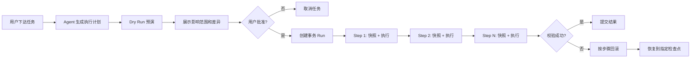

| 优先级 | 功能                   | 核心作用                                                      | 为什么有价值                                                                 |
| --- | -------------------- | --------------------------------------------------------- | ---------------------------------------------------------------------- |
| P0  | **任务回滚与事务执行**        | 执行前生成文件快照；展示修改差异；失败后自动恢复；支持回滚到任意步骤                        | WorkBuddy 能操作文件但缺少完整事务保障，Open WebUI 的工具执行也没有统一回滚机制。能显著降低 Agent 误删、误改风险 |
| P0  | **企业审批工作流**          | 按金额、数据类型、系统和操作风险自动触发指定人员审批，支持会签、超时升级和审批记录                 | 现有能力主要是用户即时确认或 RBAC，没有完整的“申请—审批—执行—审计”闭环                               |
| P0  | **Agent 自动化测试与发布门禁** | 使用标准问题集测试 Prompt、模型、知识库和工具；比较新旧版本；指标不达标则禁止发布              | 两者都有部分评测能力，但缺少类似软件 CI/CD 的自动回归测试和正式发布门禁                                |
| P0  | **可验证交付**            | 用户先定义验收条件，例如“Excel 无空值、程序测试通过、报告必须引用三项来源”；Agent 完成后自动执行验收 | 目前通常只生成结果，缺少机器可执行的“完成定义”，容易出现看似完成但实际不可用                                |
| P0  | **内容来源与数据血缘**        | 将报告中的每段文字、表格单元格、数字和结论追溯到原始文件、网页及处理步骤                      | 普通 RAG 引用只能说明“参考过哪些资料”，无法回答“这个数字究竟从哪里来、经过什么计算”                         |
| P1  | **策略即代码安全引擎**        | 用统一规则限制 Agent：哪些目录可读写、哪些数据可外发、哪些命令禁止、调用额度是多少              | Open WebUI 的 RBAC 和 WorkBuddy 的权限确认都偏静态，缺少跨模型、工具和数据源的统一动态策略            |
| P1  | **成本与 SLA 智能路由**     | 根据任务质量、速度、价格、上下文长度和模型可用性自动选模、降级、重试，并给出成本预测                | WorkBuddy 有 Auto，Open WebUI 有多模型连接，但都缺少透明、可配置、可审计的成本与服务质量路由            |
| P1  | **跨平台 Agent 包**      | 将 Prompt、模型要求、Skills、MCP、知识库声明、权限、测试集打包，一键在不同平台导入导出       | Open WebUI 配置和 WorkBuddy Manifest 都是各自体系，用户容易被平台锁定                     |
| P1  | **多人实时协作执行**         | 多人共同编辑任务目标、Prompt 和产物；在 Agent 执行过程中评论、接管、分配步骤和解决冲突        | Open WebUI 偏共享聊天，WorkBuddy 偏个人任务/结果分享，都不是完整的多人协作工作台                    |
| P1  | **企业记忆治理中心**         | 查看 AI 记住了什么、信息来源、适用范围、过期时间和使用记录；支持审批、纠错和一键遗忘              | 两者都有记忆能力，但缺少类似企业主数据管理的记忆治理、权限和生命周期控制                                   |
| P2  | **任务仿真与风险预演**        | 正式执行前模拟将调用哪些工具、修改哪些文件、发送哪些数据、预计耗时和费用                      | Plan 模式通常只展示自然语言计划，不能准确预测实际副作用和成本                                      |
| P2  | **失败接管与断点续作**        | 长任务失败时保留完整状态，自动尝试替代模型或工具；人工修正一步后可从断点继续                    | 现有 Agent 往往只能重试整项任务，重复消耗 Token，也可能重复执行外部操作                             |
| P2  | **合规与电子取证中心**        | 支持数据保留策略、法律保全、敏感数据发现、操作证据导出和完整审计链                         | 日志和数据删除不等同于满足金融、医疗、政企的合规与取证要求                                          |


**任务回滚与事务执行**

![[Pasted image 20260806163757.png]]

这个功能可以叫“事务型 Agent 执行框架”。核心思路是：Agent 每一步操作都不能直接裸奔执行，而要先经过一个统一的执行网关，自动做快照、预演、差异展示、执行记录和失败回滚。

````

````

实现上分 5 层。

第一层是“统一工具执行网关”。所有文件操作、知识库操作、API 调用、数据库写入、消息发送，都不能由 Agent 直接调用，而是走一个 `Tool Gateway`：

```
interface TransactionalTool {
  name: string
  dryRun(input): Promise<DiffPreview>
  snapshot(input): Promise<Snapshot>
  execute(input, context): Promise<ToolResult>
  rollback(snapshot, context): Promise<RollbackResult>
}
```

也就是说，每个工具都必须声明：

- 这一步会影响哪些资源
- 执行前如何生成快照
- 执行前能不能展示 diff
- 成功后如何校验
- 失败后如何回滚

第二层是“快照系统”。不同资源用不同快照方式：

|资源类型|快照方式|回滚方式|
|---|---|---|
|文件|保存原文件 hash、内容副本、patch diff|用快照覆盖回去，或反向 patch|
|知识库/RAG|文档版本化，索引版本化|切回旧索引版本|
|数据库|短事务用 DB transaction，长事务用 Saga|compensation 补偿动作|
|外部 API|调用前读取旧状态|调用反向 API 恢复|
|邮件/消息|默认只生成草稿|已发送通常不可真回滚，只能补发撤回/更正|

这里有个关键判断：不是所有动作都能真正回滚。比如“发出邮件”“调用付款 API”“删除第三方系统数据”这类动作，应该被标记为 `irreversible`，执行前必须二次确认，或者只允许进入草稿/待审批状态。

第三层是“事务运行记录”。每次任务生成一个 `run_id`，每一步都有检查点：

```
{
  "run_id": "run_20260806_001",
  "status": "running",
  "steps": [
    {
      "step_id": "step_1",
      "tool": "file.update",
      "target": "报价单.xlsx",
      "snapshot_id": "snap_001",
      "diff_id": "diff_001",
      "status": "success",
      "rollback_status": "available"
    }
  ]
}
```

有了这个结构，就能支持：

- 失败后自动回滚到任务开始前
- 回滚到任意一步
- 展示每一步改了什么
- 审计是谁、什么时候、让 AI 做了什么
- 重新执行某一步

第四层是“补偿事务”。数据库里常见的事务只能解决短时间内的写入，但 Agent 任务往往是长流程：改文件、查接口、生成报告、发审批、写知识库。这个时候要用 Saga 模式。

比如一个任务：

```
1. 上传合同
2. 解析合同
3. 写入知识库
4. 更新客户 CRM
5. 生成邮件草稿
```

对应补偿动作是：

```
5. 删除邮件草稿
6. 恢复 CRM 原字段
7. 切回旧知识库索引
8. 删除解析产物
9. 删除上传文件或恢复旧版本
```

失败时从最后一步倒着回滚。

第五层是“用户界面”。这个功能一定要让用户看得懂，否则就会变成后台黑盒。建议 UI 做成这样：

```
任务执行前：
- 本次将修改 3 个文件
- 将新增 2 条知识库记录
- 将调用 CRM API 1 次
- 不会发送邮件，只创建草稿
- 可回滚：是

任务执行中：
Step 1 已完成，可回滚
Step 2 已完成，可回滚
Step 3 失败，正在恢复到 Step 1 前状态

任务执行后：
查看差异 / 回滚到此处 / 重新执行 / 导出审计记录
```

最小 MVP 可以这样做：

1. 先只支持文件和知识库回滚  
    文件改动前复制快照，知识库用版本号切换。
    
2. 所有工具加 `dryRun`  
    先展示“将要改什么”，用户确认后再执行。
    
3. 每一步保存 `snapshot + diff + result`  
    这样失败时可以自动恢复。
    
4. 对不可逆操作加拦截  
    比如发送邮件、删除远程数据、付款、提交审批，默认进入“待确认”。
    
5. 做一个回滚面板  
    用户能看到每一步，并点击“回滚到这一步”。
    

我会建议 WorkBuddy 如果做这个功能，先不要追求“所有应用都可回滚”。最现实、也最有产品价值的第一版是：

```
文件操作事务化 + 知识库版本化 + API 调用补偿 + 不可逆动作审批
```

这个已经足够形成明显差异点了。它的价值不是“AI 能不能干活”，而是“AI 干错了以后，企业敢不敢让它继续干活”。

协作**多人实时产物编辑**用户和 Agent 同时编辑报告、表格或 PPT，支持评论、锁定区域和变更记录目前的“分享任务”通常只能查看结果，不能真正共同完成成果