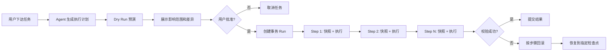

## 2期预选功能

1. **模板中心与团队复用**->做成skill
    文稿、PPT、报告的结构化模板库，支持团队保存、复用和迭代常用模板，对应规划书V1.5"模板中心、成果版本和团队复用"。
2.  **模型自动选择**
    auto参考对标矩阵中workbuddy的功能——根据模型适配哪种模型适合哪种问题选择模型。
3. **使用与成本分析看板（管理端）**
    空间/搭子/技能维度的使用量、试用率、启用率、成果采纳率、Token成本报表。规划书要求"记录用户是否采用和如何修改"，2期应把这些记录产品化为管理端看板。
4. **成果与对话的外部分享**
    生成只读或可评论的外链，分享给未登录平台的同事或客户查看成果，对标Open WebUI的"分享"能力。

## 3期预选功能
1. **智能体构建器（可视化配置台）**
   把目标、角色、任务边界、Prompt、知识、规则、模型统一放进一个构建界面，区别于一期"搭子=人设+知识+MCP+技能"的简单组合，是规划书V2"智能体目标、角色、任务和边界"配置能力的落地。
2.  **多智能体协作编排**
   多个搭子/智能体按任务拆解协同完成复杂任务（如"研究搭子→写作搭子→审校搭子"接力），弥补一期"对话中不支持切换搭子"的限制。
# 后续功能

1. **工作空间团队协同**
   空间内成员评论、@提及、任务分配、变更通知。目前工作空间的"成员和基础权限"停留在访问控制层，缺少协同互动能力。
2. **任务回滚与事务执行**

![[Pasted image 20260806163757.png]]

这个功能可以叫“事务型 Agent 执行框架”。核心思路是：Agent 每一步操作都不能直接裸奔执行，而要先经过一个统一的执行网关，自动做快照、预演、差异展示、执行记录和失败回滚。

````

````

实现上分 5 层。

第一层是“统一工具执行网关”。所有文件操作、知识库操作、API 调用、数据库写入、消息发送，都不能由 Agent 直接调用，而是走一个 `Tool Gateway`：

```
interface TransactionalTool {
  name: string
  dryRun(input): Promise<DiffPreview>
  snapshot(input): Promise<Snapshot>
  execute(input, context): Promise<ToolResult>
  rollback(snapshot, context): Promise<RollbackResult>
}
```

也就是说，每个工具都必须声明：

- 这一步会影响哪些资源
- 执行前如何生成快照
- 执行前能不能展示 diff
- 成功后如何校验
- 失败后如何回滚

第二层是“快照系统”。不同资源用不同快照方式：
 
| 资源类型    | 快照方式                          | 回滚方式                 |
| ------- | ----------------------------- | -------------------- |
| 文件      | 保存原文件 hash、内容副本、patch diff    | 用快照覆盖回去，或反向 patch    |
| 知识库/RAG | 文档版本化，索引版本化                   | 切回旧索引版本              |
| 数据库     | 短事务用 DB transaction，长事务用 Saga | compensation 补偿动作    |
| 外部 API  | 调用前读取旧状态                      | 调用反向 API 恢复          |
| 邮件/消息   | 默认只生成草稿                       | 已发送通常不可真回滚，只能补发撤回/更正 |

这里有个关键判断：不是所有动作都能真正回滚。比如“发出邮件”“调用付款 API”“删除第三方系统数据”这类动作，应该被标记为 `irreversible`，执行前必须二次确认，或者只允许进入草稿/待审批状态。

第三层是“事务运行记录”。每次任务生成一个 `run_id`，每一步都有==检查点==：

```
{
  "run_id": "run_20260806_001",
  "status": "running",
  "steps": [
    {
      "step_id": "step_1",
      "tool": "file.update",
      "target": "报价单.xlsx",
      "snapshot_id": "snap_001",
      "diff_id": "diff_001",
      "status": "success",
      "rollback_status": "available"
    }
  ]
}
```

有了这个结构，就能支持：

- 失败后自动回滚到任务开始前
- 回滚到任意一步
- 展示每一步改了什么
- 审计是谁、什么时候、让 AI 做了什么
- 重新执行某一步

第四层是“补偿事务”。数据库里常见的事务只能解决短时间内的写入，但 Agent 任务往往是长流程：改文件、查接口、生成报告、发审批、写知识库。这个时候要用 Saga 模式。
### 为什么需要Saga模式？

- **传统事务（ACID）的一贯：**数据库事务要求“全部成功或全部失败”，并且会锁住资源。但如果一个流程很长（比如你的截图里：_上传合同->解析->写知识库->改CRM->发邮件_），时间太久，长时间锁住资源会导致系统卡死；条件且跨/API操作（如发系统邮件、查第三方接口）根本无法用数据库事务来直接“回滚”。
    
- **Saga的解决思路：**允许每个小步骤**立即提交**（不长时间锁定资源）。如果后续某一步失败了，系统就按照原路**逆序执行对应的“补偿操作”**，把已经之前的“抹平”改变，达到最终的一致性。
比如一个任务：

```
1. 上传合同
2. 解析合同
3. 写入知识库
4. 更新客户 CRM
5. 生成邮件草稿
```

对应补偿动作是：

```
5. 删除邮件草稿
6. 恢复 CRM 原字段
7. 切回旧知识库索引
8. 删除解析产物
9. 删除上传文件或恢复旧版本
```

失败时从最后一步倒着回滚。

第五层是“用户界面”。这个功能一定要让用户看得懂，否则就会变成后台黑盒。建议 UI 做成这样：

```
任务执行前：
- 本次将修改 3 个文件
- 将新增 2 条知识库记录
- 将调用 CRM API 1 次
- 不会发送邮件，只创建草稿
- 可回滚：是

任务执行中：
Step 1 已完成，可回滚
Step 2 已完成，可回滚
Step 3 失败，正在恢复到 Step 1 前状态

任务执行后：
查看差异 / 回滚到此处 / 重新执行 / 导出审计记录
```

最小 MVP 可以这样做：

1. 先只支持文件和知识库回滚  
    文件改动前复制快照，知识库用版本号切换。
    
2. 所有工具加 `dryRun`  
    先展示“将要改什么”，用户确认后再执行。
    
3. 每一步保存 `snapshot + diff + result`  
    这样失败时可以自动恢复。
    
4. 对不可逆操作加拦截  
    比如发送邮件、删除远程数据、付款、提交审批，默认进入“待确认”。
    
5. 做一个回滚面板  
    用户能看到每一步，并点击“回滚到这一步”。
    

我会建议 WorkBuddy 如果做这个功能，先不要追求“所有应用都可回滚”。最现实、也最有产品价值的第一版是：

```
文件操作事务化 + 知识库版本化 + API 调用补偿 + 不可逆动作审批
```

这个已经足够形成明显差异点了。它的价值不是“AI 能不能干活”，而是“AI 干错了以后，企业敢不敢让它继续干活”。

协作**多人实时产物编辑**用户和 Agent 同时编辑报告、表格或 PPT，支持评论、锁定区域和变更记录目前的“分享任务”通常只能查看结果，不能真正共同完成成果


