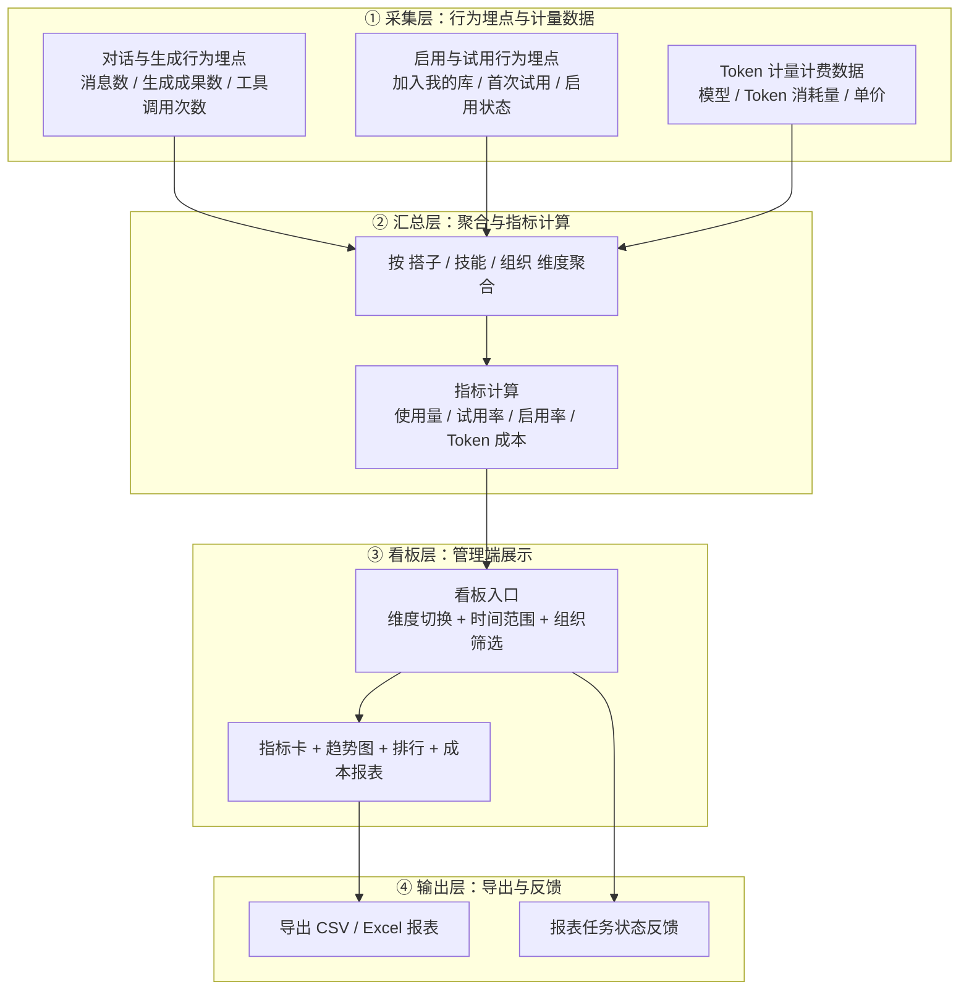

## 用户故事：
**使用与成本分析看板（管理端）**
    作为一名超级管理员 / 企业管理员，我希望能够在管理后台查看按「搭子 / 技能」维度聚合的使用量、试用率、启用率与 Token 成本报表，以便于掌握各能力单元的真实使用与成本效益，为资源优化、定价计费和产品迭代提供数据依据。
验收标准：
     1. 维度报表：支持按「搭子 / 技能」维度查看使用量、试用率、启用率（支持维度切换、时间范围与组织筛选）
     2. Token 成本报表：按搭子 / 技能 / 模型 / 组织查看 Token 消耗量与折算成本（含环比与占比）
     3. 报表导出：支持导出 CSV / Excel（含原始数据与图表快照）

### 指标口径

| 指标       | 口径定义                                                     | 统计维度               |
| ---------- | ------------------------------------------------------------ | ---------------------- |
| 使用量     | 对话消息数、AI 生成成果数、工具调用次数                       | 搭子 / 技能            |
| 试用率     | 试用过该单元的独立用户数 ÷ 周期内活跃用户数                   | 搭子 / 技能            |
| 启用率     | 已启用（加入"我的库"/开启使用）该单元的用户数 ÷ 总用户数      | 搭子 / 技能            |
| Token 成本 | Σ（各模型 Token 消耗量 × 单价），支持按搭子/技能/模型/组织下钻 | 搭子 / 技能 / 模型 / 组织 |

## 核心流程图

## 状态说明（StateSpecifications）

系统中的报表任务共有 3 种核心状态，分别对应不同的控制逻辑与用户提示：

| 状态类型 | 状态名称 | 触发条件/场景说明 | 界面UI/UX表现 |
| -------- | -------- | ---------------- | ------------- |
| **蓝色** | **加载中** | 用户切换维度 / 时间范围 / 组织筛选，触发数据查询与报表生成 | • 指标卡显示骨架屏（Skeleton） • 图表区显示加载动画 • 提示文本："正在生成报表..." |
| **绿色** | **加载成功** | 数据查询完成，指标卡与图表正常渲染 | • 展示指标卡数值、趋势图与排行 • 右上角显示"最后更新 HH:mm" • 支持导出报表 |
| **红色** | **加载失败** | 数据源异常 / 服务超时 / 无查询权限 / 查询结果为空 | • 图表区展示错误占位 + 失败原因 • 附"重试"按钮 • 空数据时展示空态提示"暂无数据" |
