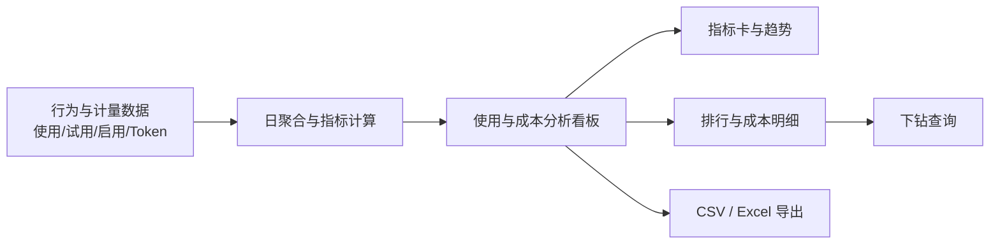
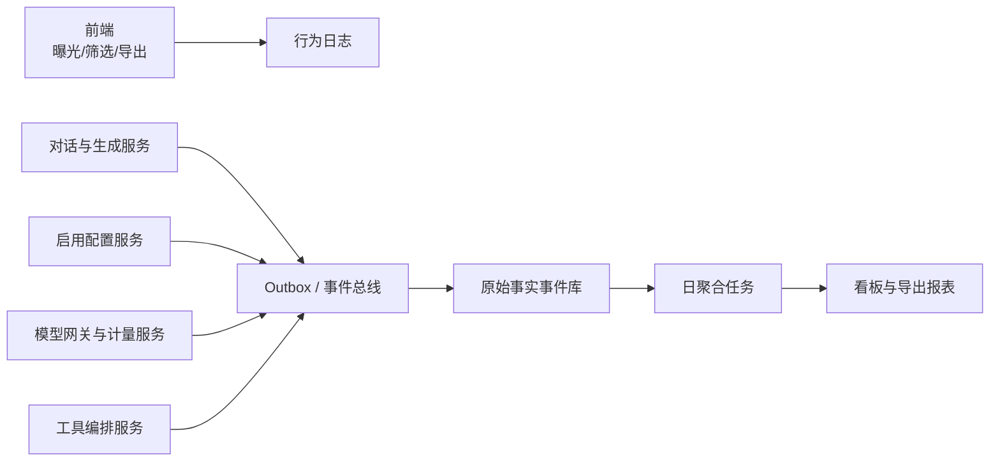

# 使用与成本分析看板（管理端）PRD

| 文档信息 | 内容 |
| --- | --- |
| 产品名称 | 使用与成本分析看板（管理端） |
| 文档版本 | V1.0 |
| 目标用户 | 超级管理员、企业管理员 |
| 文档状态 | 待评审 |
| 更新时间 | 2026-08-17 |

## 1. 项目背景

平台中的「搭子」与「技能」持续被配置、启用和使用，并消耗不同模型的 Token。当前管理员无法在同一入口核对能力单元的使用表现、用户采纳情况与模型成本，因而难以判断哪些能力应继续投入、优化资源配置、调整定价或推动产品迭代。

本项目在管理端新增“使用与成本分析看板”，将行为埋点、启用/试用事件及 Token 计量计费数据按统一口径汇总，并提供筛选、下钻和导出能力。

## 2. 目标与范围

### 2.1 产品目标

1. 让有权限的管理员在一个页面掌握搭子、技能的使用量、试用率、启用率和 Token 成本。
2. 支持从总体表现定位至搭子、技能、模型和组织，识别高成本或低采纳能力单元。
3. 提供可复用、可追溯的 CSV/Excel 报表，供资源优化、定价计费和经营分析使用。

### 2.2 成功指标

1. 管理员可在 3 分钟内完成一次指定时间范围和组织下的指标查询并导出。
2. 报表中的使用量、Token 消耗量及折算成本与同口径数据源的差异不超过 0.1%。
3. 所有导出数据均遵循当前管理员的数据权限，不出现越权组织数据。

### 2.3 本期范围

| 范围 | 说明 |
| --- | --- |
| 指标展示 | 使用量、试用率、启用率、Token 消耗量、Token 折算成本、环比、占比 |
| 分析维度 | 搭子、技能、模型、组织、时间 |
| 页面能力 | 筛选、维度切换、趋势查看、排行榜、成本明细下钻、导出、状态反馈 |
| 数据粒度 | 按天汇总用于趋势；按当前筛选条件汇总用于指标卡和明细表 |

### 2.4 非本期范围

1. 自动预算预警、成本阈值通知和成本预测。
2. 自助修改模型单价、历史成本回算和计费结算。
3. 面向普通成员的个人使用分析页。
4. 自定义指标公式及跨租户对标。

## 3. 用户与权限

| 角色 | 可访问数据 | 主要操作 |
| --- | --- | --- |
| 超级管理员 | 全部组织及其下级组织的数据 | 查看、筛选、下钻、导出 |
| 企业管理员 | 被授权组织及其下级组织的数据 | 查看、筛选、下钻、导出 |
| 无权限用户 | 无 | 不展示菜单入口；直达链接返回无权限页 |

权限以服务端鉴权为准。组织筛选器仅返回当前用户可见的组织；导出任务也必须在服务端再次校验权限。

## 4. 指标定义与数据规则

### 4.1 指标口径

| 指标 | 计算口径 | 统计维度 | 展示规则 |
| --- | --- | --- | --- |
| 使用量 | 对话消息数、AI 生成成果数、工具调用次数 | 搭子、技能 | 展示总量及三项构成；总使用量 = 三项之和 |
| 试用率 | 周期内首次试用该单元的去重用户数 ÷ 周期内活跃用户数 | 搭子、技能 | 百分比，保留 1 位小数；分母为 0 时展示 `--` |
| 启用率 | 截至查询结束日，已将该单元加入“我的库”或开启使用的去重用户数 ÷ 当前组织总用户数 | 搭子、技能 | 百分比，保留 1 位小数；分母为 0 时展示 `--` |
| Token 消耗量 | 输入 Token 与输出 Token 的合计 | 搭子、技能、模型、组织 | 展示总量，并在明细中展示输入/输出拆分 |
| Token 折算成本 | Σ（模型输入 Token × 输入单价 + 模型输出 Token × 输出单价） | 搭子、技能、模型、组织 | 按账单币种展示，保留 2 位小数 |
| 环比 | （当前周期指标 - 上一等长周期指标）÷ 上一等长周期指标 | 全部指标 | 正负方向与业务含义在提示中说明；上期为 0 时展示 `--` |
| 占比 | 当前行指标 ÷ 当前筛选范围内同指标合计 | 成本、Token 消耗量 | 百分比，保留 1 位小数；合计为 0 时展示 `--` |

### 4.2 统计规则

1. 活跃用户定义为查询周期内至少发生一次登录、对话、生成或工具调用行为的去重用户。
2. 首次试用按“用户 + 能力单元”去重，以该组合在系统内首次有效使用事件发生日判断；无效、失败或测试事件不纳入。
3. “搭子”和“技能”均使用事件发生时记录的版本与归属；已删除或下线的单元保留历史数据，并标注“已下线”。
4. 成本使用事件发生时生效的模型价格快照计算；价格缺失的记录在报表中计入 Token、成本显示为 `待核算`，并记录异常数。
5. 默认时间范围为最近 30 天（含当天），时区统一为企业配置时区；按自然日统计。
6. 数据按日完成汇总，数据延迟目标不超过 24 小时；页面显示“数据截至 YYYY-MM-DD”和最后刷新时间。

## 5. 信息架构与核心流程



入口：管理端导航「数据分析」>「使用与成本分析」。

## 6. 功能需求

### 6.1 全局筛选与维度切换

页面顶部提供以下控件，任一条件变更后自动刷新页面数据。

| 控件 | 选项/规则 |
| --- | --- |
| 分析维度 | `搭子`、`技能`；默认“搭子” |
| 时间范围 | 快捷选项：最近 7 天、最近 30 天、本月、上月；支持自定义日期范围，最长 366 天 |
| 组织 | 默认当前管理员所属组织；超级管理员可选择全部组织或任一有权限组织，支持包含下级组织 |
| 对比方式 | 默认环比；以所选周期长度自动计算上一等长周期 |

筛选条件应同步显示在图表、明细表和导出文件中。刷新期间保留已选择条件，避免页面布局跳动。

### 6.2 概览区

概览区包含四张指标卡：总使用量、平均试用率、平均启用率、Token 折算成本。

1. 每张卡展示当前值、环比值/方向、数据截至日期。
2. 总使用量卡支持展开查看消息数、生成成果数、工具调用次数。
3. 试用率、启用率卡显示计算分子/分母的悬浮说明。
4. Token 成本卡同时展示 Token 消耗总量和成本占比最高的模型。

### 6.3 使用与采纳分析

1. 提供按日的使用量趋势图，可切换查看总使用量、消息数、生成成果数、工具调用次数。
2. 提供按当前分析维度的排行榜，列包括名称、使用量、试用率、启用率、环比；默认按使用量降序，支持按任一数值列排序。
3. 点击排行榜行，打开该搭子或技能的详情抽屉，展示日趋势、指标构成及关联成本概览。
4. 单元名称、所属状态（正常/已下线）和数据统计周期应在列表中清晰可见。

### 6.4 Token 成本分析

1. 成本区展示按日的 Token 消耗量与折算成本双趋势图。
2. 成本构成支持切换分组维度：搭子、技能、模型、组织；默认沿用当前分析维度。
3. 成本明细表包含分组名称、输入 Token、输出 Token、Token 合计、折算成本、成本环比、成本占比。
4. 点击搭子或技能可下钻至其关联模型；点击组织可下钻至该组织下的搭子/技能。面包屑展示当前下钻路径，支持返回上一级。
5. 单次查询最多展示前 100 条明细；其余数据可通过导出获取。列表支持分页或“加载更多”。

### 6.5 报表导出

1. 点击“导出报表”后，系统按当前筛选条件生成文件，格式可选 CSV 或 Excel。
2. CSV 包含当前明细的原始汇总数据；Excel 包含“概览”“使用与采纳”“Token 成本”“图表快照”四个工作表。
3. 图表快照需包含筛选条件、生成时间、数据截至日期；图片应与当前页面图表一致。
4. 导出完成后提供下载入口；文件名格式为：`使用与成本分析_{维度}_{组织}_{开始日期}-{结束日期}_{生成时间}.{ext}`。
5. 导出任务失败时显示失败原因并允许重试；生成的文件仅对创建人可下载，有效期 7 天。

### 6.6 页面状态与异常处理

| 状态 | 触发场景 | 页面表现 | 可用操作 |
| --- | --- | --- |
| 加载中 | 首次进入或变更筛选条件 | 指标卡骨架屏、图表加载态、“正在生成报表...” | 筛选控件可调整；导出按钮禁用 |
| 加载成功 | 查询返回有效数据 | 渲染指标、图表、明细与最后更新时间 | 下钻、排序、导出 |
| 空数据 | 查询成功但无符合条件的记录 | 显示“暂无数据”，保留筛选条件和口径入口 | 更改筛选条件、导出空表 |
| 加载失败 | 数据源异常、超时或服务错误 | 显示错误说明与“重试” | 重试、调整筛选条件 |
| 无权限 | 访问的组织超出权限 | 显示无权限页，不展示任何数据 | 返回上级页面 |

## 7. 用户故事

| 编号 | 用户故事 | 优先级 |
| --- | --- | --- |
| US-01 | 作为超级管理员，我希望按搭子或技能切换查看使用量、试用率和启用率，以识别采纳表现较差的能力单元。 | P0 |
| US-02 | 作为企业管理员，我希望仅查看本组织及已授权下级组织的数据，以在不越权的前提下进行经营分析。 | P0 |
| US-03 | 作为管理员，我希望按时间范围和组织筛选数据，并看到环比变化，以比较不同周期的使用和成本表现。 | P0 |
| US-04 | 作为成本负责人，我希望按搭子、技能、模型和组织查看 Token 消耗与成本占比，并可下钻，以定位成本来源。 | P0 |
| US-05 | 作为管理员，我希望导出当前筛选结果及图表快照，以便提交经营复盘或进一步分析。 | P0 |
| US-06 | 作为管理员，我希望在没有数据、查询失败或没有权限时得到明确提示和可执行操作，以避免误判报表状态。 | P1 |

## 8. 验收标准

### 8.1 维度报表

| 编号 | 验收条件 |
| --- | --- |
| AC-01 | 管理员进入页面时，默认展示最近 30 天、默认组织、搭子维度的报表；页面展示数据截至日期。 |
| AC-02 | 在“搭子”和“技能”之间切换后，指标卡、趋势图、排行榜和导出数据均切换为对应维度，且筛选条件不丢失。 |
| AC-03 | 选择任一快捷时间范围或合法的自定义日期范围后，页面按所选自然日范围刷新；自定义范围超过 366 天时不可提交并给出提示。 |
| AC-04 | 有组织权限的管理员仅可在筛选器和查询结果中看到被授权组织及其下级组织；服务端接口对越权组织请求返回无权限结果。 |
| AC-05 | 使用量、试用率、启用率严格按第 4.1 节口径计算；分母为 0 或上期值为 0 时展示 `--`，不展示无穷大或错误百分比。 |
| AC-06 | 排行榜默认按使用量降序，支持数值列排序；点击行可查看对应单元的趋势、构成和成本概览。 |

### 8.2 Token 成本报表

| 编号 | 验收条件 |
| --- | --- |
| AC-07 | 成本区可按搭子、技能、模型和组织分组，明细表展示输入 Token、输出 Token、Token 合计、折算成本、环比和占比。 |
| AC-08 | 任一成本明细的 Token 合计等于输入 Token 与输出 Token 之和；成本等于价格快照下输入、输出 Token 成本之和，允许因展示精度产生不超过 0.01 的差异。 |
| AC-09 | 成本占比以当前筛选条件和当前分组范围的总成本为分母；全部明细占比之和因四舍五入允许在 99.9% 至 100.1% 之间。 |
| AC-10 | 从搭子/技能下钻模型、从组织下钻能力单元时，面包屑反映路径，结果数据与父级筛选条件一致，且可以返回上级。 |
| AC-11 | 价格缺失记录在页面中被标识为“待核算”，Token 仍纳入统计，且不以 0 成本混入已核算成本。 |

### 8.3 导出与状态

| 编号 | 验收条件 |
| --- | --- |
| AC-12 | CSV 导出包含当前筛选条件下的完整原始汇总数据；Excel 包含概览、使用与采纳、Token 成本、图表快照四个工作表。 |
| AC-13 | 导出文件携带筛选条件、生成时间和数据截至日期；图表快照与导出发起时页面展示内容一致。 |
| AC-14 | 导出数据必须经过服务端权限校验，且文件仅创建人可下载，有效期为 7 天。 |
| AC-15 | 查询过程中展示加载态并禁用导出；查询成功后展示最后更新时间并启用导出。 |
| AC-16 | 查询成功但无记录时展示空态“暂无数据”；数据异常、超时或服务错误时展示失败态和重试按钮；两者不得混用。 |

### 8.4 埋点与数据质量

| 编号 | 验收条件 |
| --- | --- |
| AC-17 | 对话消息、AI 生成成果、工具调用、启用状态变更和模型调用完成，均在服务端业务成功落库后产生事件；前端事件不得作为使用量或成本的唯一数据源。 |
| AC-18 | 每条业务事件均包含 `event_id`、`occurred_at`、`organization_id`、`user_id`、搭子/技能标识、`request_id` 和事件结果；缺少任一统计必填字段的事件进入异常队列，不写入聚合指标。 |
| AC-19 | 同一 `event_id` 的重复投递只计一次；同一 `request_id + usage_type + tool_call_id` 的重复事件不重复计入使用量或 Token。 |
| AC-20 | 单次模型调用完成后上报的输入/输出 Token、模型 ID 和价格快照可与网关调用日志通过 `request_id` 一一关联；抽样核对 100 条记录时一致率为 100%。 |
| AC-21 | 试用用户可由原始成功使用事件按“用户 + 能力单元”求首次记录推导；同一用户在同一单元周期内多次使用，只计为 1 个试用用户。 |
| AC-22 | 启用事件仅在启用状态事务提交成功后产生；每日启用用户快照与能力配置库的有效启用状态核对差异不超过 0.1%。 |
| AC-23 | 事件可延迟到达；聚合任务至少重算最近 7 个自然日，迟到事件在下次重算后应反映在对应统计日中。 |
| AC-24 | 埋点不记录用户输入文本、模型输出正文、访问令牌或其他敏感内容；用户标识仅用于受控原始明细计算，报表仅展示聚合结果。 |

## 9. 数据依赖与埋点要求

| 数据域 | 必填字段 | 用途 |
| --- | --- | --- |
| 使用事件 | 事件时间、用户 ID、组织 ID、搭子 ID、技能 ID、事件类型、事件结果 | 计算消息数、生成成果数、工具调用次数、活跃用户与首次试用 |
| 启用事件 | 事件时间、用户 ID、组织 ID、能力单元 ID、启用状态 | 计算启用用户数 |
| Token 计量 | 发生时间、组织 ID、搭子 ID、技能 ID、模型 ID、输入 Token、输出 Token、价格快照 ID | 计算 Token 与成本 |
| 能力单元主数据 | 单元 ID、名称、类型、状态、归属关系 | 名称展示、搭子/技能聚合、下线标识 |
| 组织与权限 | 组织 ID、层级关系、管理员 ID、授权范围 | 组织筛选与服务端鉴权 |

### 9.1 埋点总体方案

采用“前端交互埋点 + 服务端事实事件 + 离线聚合”的三层方案。

1. 前端仅采集页面曝光、筛选、下钻和导出发起等交互，用于优化看板体验和审计；不参与使用量、试用率、启用率和成本的计算。
2. 服务端在业务事务成功后，通过事件总线或 Outbox（事务外盒）投递事实事件。核心业务指标只能消费此类事件。
3. 原始事件入库后，按自然日、组织、搭子、技能、模型聚合。每天重算最近 7 天，用于修正网络重试、异步回调和迟到事件。
4. 所有事件以 `event_id` 去重，以 `request_id` 串联一次用户请求、模型调用和工具调用；聚合明细保留事件来源、版本和价格快照，支持追溯。



### 9.2 事件字典与埋点位置

#### 9.2.1 前端交互事件

| 事件名 | 埋点位置 | 触发时机 | 必填扩展字段 | 用途 | 是否进入核心指标 |
| --- | --- | --- | --- | --- | --- |
| `report_viewed` | 管理端看板页面 | 页面首次成功加载并拿到当前用户权限后 | `page_name`、`default_dimension`、`default_date_range` | 统计看板访问量 | 否 |
| `report_filter_changed` | 维度、时间、组织筛选控件 | 用户提交新筛选条件时，每次条件变化只发 1 条 | `dimension`、`date_start`、`date_end`、`organization_scope` | 分析筛选使用情况 | 否 |
| `report_drilldown_opened` | 成本明细或排行榜行 | 详情抽屉/下钻结果成功打开时 | `from_dimension`、`to_dimension`、`entity_id`、`drilldown_path` | 分析下钻路径 | 否 |
| `report_export_requested` | 导出按钮 | 用户确认格式并创建导出任务成功时 | `export_format`、`dimension`、`date_start`、`date_end`、`organization_scope`、`export_task_id` | 导出审计 | 否 |
| `report_export_downloaded` | 下载链接 | 浏览器收到下载地址且下载动作开始时 | `export_task_id`、`export_format` | 文件下载审计 | 否 |

前端事件应通过现有埋点 SDK 发送，失败可异步重试一次；不得阻塞页面渲染、筛选或导出流程。事件中不得携带明细数据、用户输入文本或 Token 数值。

#### 9.2.2 服务端核心事实事件

| 事件名 | 生产服务/代码位置 | 精确触发点 | 计数规则 | 用于指标 |
| --- | --- | --- | --- | --- |
| `conversation_message_succeeded` | 对话服务，消息持久化事务 | 用户消息通过校验且消息记录提交成功后 | 每条成功提交的用户消息计 1 | 消息数、使用量、活跃用户、试用判定 |
| `ai_generation_succeeded` | 生成服务，生成结果持久化事务 | AI 最终结果已保存且状态为 `success` 后 | 每个可展示的生成结果计 1；流式分片不重复计数 | 生成成果数、使用量、活跃用户、试用判定 |
| `tool_call_succeeded` | 工具编排服务，工具结果落库事务 | 工具返回成功结果且已写入调用记录后 | 每次成功工具调用计 1；失败、超时、取消不计 | 工具调用次数、使用量、活跃用户、试用判定 |
| `unit_enabled` | 搭子/技能配置服务，启用状态事务 | “加入我的库”或“开启使用”状态提交成功后 | 记录状态从未启用变为启用 | 启用率、启用审计 |
| `unit_disabled` | 搭子/技能配置服务，启用状态事务 | 状态从启用变为未启用且提交成功后 | 不减少历史使用数据；更新当前启用状态 | 启用率、启用审计 |
| `model_invocation_completed` | 模型网关/计量服务，供应商响应解析后 | 已获得最终输入/输出 Token，且计量记录提交成功后 | 每一次实际模型调用计 1；重试请求必须使用新的 `request_id` | 输入 Token、输出 Token、Token 成本 |

说明：`conversation_message_succeeded`、`ai_generation_succeeded` 与 `tool_call_succeeded` 可能关联同一个用户请求，但它们对应使用量的不同构成，应分别计数；同一个事件不得因消息流式输出、异步投递重试或页面刷新而重复计数。

### 9.3 公共字段规范

所有服务端事实事件使用以下公共字段；字段名保持英文 snake_case，枚举值由数据字典统一维护。

| 字段 | 类型 | 必填 | 示例 | 说明 |
| --- | --- | --- | --- | --- |
| `event_id` | string (UUID) | 是 | `evt_01J...` | 事件全局唯一 ID，用于投递幂等去重 |
| `event_name` | string | 是 | `ai_generation_succeeded` | 事件名称，必须来自第 9.2 节字典 |
| `event_version` | integer | 是 | `1` | 事件结构版本；字段新增时升级版本 |
| `occurred_at` | ISO 8601 datetime | 是 | `2026-08-17T10:30:02+08:00` | 事实发生时间，不使用消息消费时间替代 |
| `emitted_at` | ISO 8601 datetime | 是 | `2026-08-17T10:30:03+08:00` | 事件投递时间，用于监控延迟 |
| `organization_id` | string | 是 | `org_001` | 事件发生时用户所属组织；组织迁移不回写历史事件 |
| `user_id` | string | 是 | `usr_123` | 内部不可逆用户标识；不得使用手机号、邮箱等直接身份信息 |
| `assistant_id` | string/null | 条件必填 | `asst_001` | 搭子 ID；搭子场景必填，技能独立使用时可为空 |
| `skill_id` | string/null | 条件必填 | `skill_001` | 技能 ID；技能场景必填，搭子未关联技能时可为空 |
| `unit_type` | enum | 是 | `assistant` | `assistant`、`skill` 或 `assistant_skill` |
| `unit_id` | string | 是 | `skill_001` | 当前统计能力单元 ID；与 `unit_type` 共同确定聚合对象 |
| `unit_version` | string/null | 否 | `v3` | 使用当时的能力单元版本，用于版本回溯 |
| `request_id` | string | 是 | `req_abc` | 一次用户请求或系统调用的链路 ID，用于跨服务关联 |
| `trace_id` | string/null | 否 | `trace_xyz` | 可观测链路追踪 ID，用于排障 |
| `result_status` | enum | 是 | `success` | 核心统计事件只能写入 `success`；失败事件进入运行监控，不进入聚合 |
| `source` | enum | 是 | `web` | 触发来源，如 `web`、`api`、`mobile`、`system` |

`assistant_id` 与 `skill_id` 至少一个必填；当一次调用同时属于搭子和技能时两者均填写，分别参与对应维度聚合。服务端应在事件产生时从请求上下文补齐组织、能力单元和版本信息，禁止由前端传入后直接信任。

### 9.4 事件专属字段与示例

#### 9.4.1 使用事实事件

| 事件 | 专属字段 | 允许值/规则 |
| --- | --- | --- |
| `conversation_message_succeeded` | `message_id`、`conversation_id`、`message_type` | `message_type` 固定为 `user`；`message_id` 在同一组织内唯一 |
| `ai_generation_succeeded` | `generation_id`、`conversation_id`、`generation_type` | `generation_type` 如 `chat_reply`、`document`、`image`；一个最终成果只有一个 `generation_id` |
| `tool_call_succeeded` | `tool_call_id`、`tool_name`、`tool_type` | `tool_call_id` 在一次请求内唯一；仅实际执行且成功的调用上报 |

示例：AI 生成完成事件。

```json
{
  "event_id": "evt_01JH7TZF3BKY",
  "event_name": "ai_generation_succeeded",
  "event_version": 1,
  "occurred_at": "2026-08-17T10:30:02+08:00",
  "emitted_at": "2026-08-17T10:30:03+08:00",
  "organization_id": "org_001",
  "user_id": "usr_123",
  "assistant_id": "asst_001",
  "skill_id": "skill_001",
  "unit_type": "assistant_skill",
  "unit_id": "skill_001",
  "unit_version": "v3",
  "request_id": "req_abc",
  "result_status": "success",
  "source": "web",
  "generation_id": "gen_789",
  "conversation_id": "conv_456",
  "generation_type": "chat_reply"
}
```

#### 9.4.2 启用状态事件

| 字段 | 说明 |
| --- | --- |
| `enable_action` | `enable` 或 `disable`，与事件名保持一致 |
| `previous_enabled` | 变更前状态，布尔值 |
| `current_enabled` | 变更后状态，布尔值 |
| `enabled_at` | 首次启用时间；禁用时保留历史首次启用时间 |
| `state_record_id` | 启用状态表主键，用于和状态快照核对 |

重复点击启用按钮但状态未改变时，不产生 `unit_enabled` 事件。每日聚合启用率时，以查询结束日的启用状态快照为准，事件仅用于状态变更审计与快照修复。

#### 9.4.3 模型计量与成本事件

| 字段 | 类型 | 必填 | 说明 |
| --- | --- | --- | --- |
| `model_invocation_id` | string | 是 | 模型网关一次实际调用的唯一 ID |
| `model_id` | string | 是 | 平台标准模型 ID，不使用展示名称聚合 |
| `provider` | string | 是 | 模型提供方标识 |
| `input_tokens` | integer | 是 | 非负整数，来自供应商最终 usage 或统一 tokenizer |
| `output_tokens` | integer | 是 | 非负整数，来自供应商最终 usage 或统一 tokenizer |
| `cached_input_tokens` | integer | 否 | 若计费模型支持缓存输入，单独记录 |
| `billable_input_tokens` | integer | 是 | 参与计费的输入 Token，未提供时等于 `input_tokens` |
| `billable_output_tokens` | integer | 是 | 参与计费的输出 Token，未提供时等于 `output_tokens` |
| `input_unit_price` | decimal | 是 | 发生时输入 Token 单价，使用最小计费单位 |
| `output_unit_price` | decimal | 是 | 发生时输出 Token 单价，使用最小计费单位 |
| `currency` | string | 是 | 平台账单币种，如 `CNY` |
| `price_snapshot_id` | string | 是 | 模型、币种、单价、有效期对应的不可变价格快照 |
| `cost_amount` | decimal/null | 是 | 事件成本；价格缺失时为 `null`，不可写 0 |
| `billing_status` | enum | 是 | `settled`、`pending_price`、`excluded` |

成本计算公式：

`cost_amount = billable_input_tokens × input_unit_price + billable_output_tokens × output_unit_price`

`model_invocation_completed` 必须在流式响应结束、重试完成并取得最终计量数据后产生。供应商未返回 Token 时，可由统一 tokenizer 补算，并将 `token_source` 标记为 `estimated`；看板需能区分真实计量和估算计量。

### 9.5 指标聚合与计算规则

| 指标 | 原始事件/状态来源 | 聚合键 | 具体计算 |
| --- | --- | --- | --- |
| 消息数 | `conversation_message_succeeded` | 统计日、组织、搭子、技能 | `count(distinct message_id)` |
| 生成成果数 | `ai_generation_succeeded` | 统计日、组织、搭子、技能 | `count(distinct generation_id)` |
| 工具调用次数 | `tool_call_succeeded` | 统计日、组织、搭子、技能 | `count(distinct tool_call_id)` |
| 总使用量 | 上述三类事件 | 统计日、组织、搭子、技能 | 消息数 + 生成成果数 + 工具调用次数 |
| 活跃用户数 | 三类成功使用事件 | 统计周期、组织 | `count(distinct user_id)` |
| 试用用户数 | 三类成功使用事件 | 统计周期、组织、能力单元 | 在全历史范围按 `user_id + unit_type + unit_id` 取首次成功使用时间，首次时间落在当前周期内的用户数 |
| 启用用户数 | 启用状态快照 | 查询结束日、组织、能力单元 | `count(distinct user_id)`，仅统计 `current_enabled=true` |
| 输入/输出 Token | `model_invocation_completed` | 统计日、组织、搭子、技能、模型 | 分别汇总已完成调用的输入/输出 Token |
| Token 成本 | `model_invocation_completed` | 统计日、组织、搭子、技能、模型 | 汇总 `billing_status=settled` 的 `cost_amount`；`pending_price` 单独汇总待核算金额/条数 |

试用率和启用率使用第 4.1 节公式。聚合任务对事件按 `event_id` 去重，并对使用量的业务主键二次去重：消息以 `message_id`、生成以 `generation_id`、工具以 `tool_call_id`、模型调用以 `model_invocation_id` 为准。

### 9.6 投递、去重与补偿规则

1. 业务服务与 Outbox 写入必须处于同一数据库事务；事务提交后由投递程序异步发送，防止业务成功但事件丢失。
2. 消费端采用至少一次投递语义，并以 `event_id` 实现幂等。原始事件表对 `event_id` 设置唯一约束，重复消息记录投递日志但不重复入库。
3. 调用超时、网络中断或消息队列重试不得改变 `event_id`；业务级重试实际发起新的模型调用时，必须生成新的 `model_invocation_id` 和 `request_id`，并通过 `retry_of_request_id` 关联前次尝试。
4. 事件到达晚于 `occurred_at` 所在自然日时，仍按 `occurred_at` 归属统计日。日聚合每天重算最近 7 天；超过 7 天的补数须走人工或补数任务，并保留变更审计。
5. 无法解析、字段缺失、Token 为负数、成本与价格快照不一致的事件进入死信/异常队列，并产生数据质量告警；不得静默丢弃或以 0 值入表。
6. 原始事件至少保留 13 个月；日聚合数据保留期限遵循平台数据治理规范，以支持同比和审计追溯。

### 9.7 数据质量监控与联调清单

| 检查项 | 校验方式 | 告警阈值/处理方式 |
| --- | --- | --- |
| 事件投递延迟 | `emitted_at - occurred_at` | P95 超过 5 分钟告警 |
| 事件消费延迟 | 消费入库时间 - `emitted_at` | P95 超过 10 分钟告警 |
| 重复事件率 | 重复 `event_id` 数 ÷ 总事件数 | 超过 0.5% 告警并排查重试链路 |
| 必填字段完整率 | 合法事件数 ÷ 接收事件数 | 低于 99.9% 阻断对应聚合并告警 |
| 计量一致性 | 网关调用日志与 Token 事件按 `request_id` 对账 | 每日抽样不一致即告警；全量差异超过 0.1% 告警 |
| 启用快照一致性 | 启用状态表与日快照按用户、能力单元对账 | 差异超过 0.1% 触发快照重建 |
| 聚合完整性 | 原始事件聚合值与看板明细值对账 | 使用量或 Token 差异超过 0.1% 不发布该统计日 |

联调至少覆盖：成功对话、流式生成、生成失败、成功/失败工具调用、重复消息投递、启用/禁用/重复启用、模型重试、价格缺失、跨组织访问、迟到事件和导出权限校验。每个场景须提供 `request_id`、预期原始事件和预期聚合结果。

## 10. 非功能需求

1. 在数据量处于设计容量内，普通查询 P95 响应时间不超过 5 秒；超过同步查询阈值时使用异步导出任务。
2. 页面和导出均记录查询人、查询时间、筛选条件与导出结果，满足审计需要。
3. 所有金额、Token 和用户数据在传输与存储中遵循现有平台的数据安全规范；不在图表或导出中暴露个人身份信息。
4. 页面应支持当前管理端主流桌面浏览器；图表、表格和筛选控件在 1280px 宽度下无横向遮挡。

## 11. 待确认事项

1. 使用量的三项构成是否需要支持按业务类型分别设置权重，而非简单相加。
2. 启用率分母“总用户数”是否为组织当前有效成员数，及是否需要随历史日期回溯。
3. 模型价格快照的币种、税费规则和免费额度抵扣规则是否已有统一计费服务提供。
4. “图表快照”在 Excel 中采用嵌入图片还是独立工作表中的数据图表，由导出技术方案确认。
