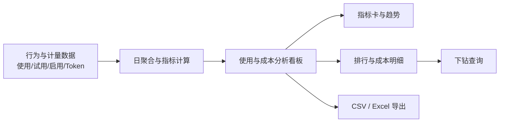

# 使用与成本分析看板（管理端）PRD

| 文档信息 | 内容             |
| ---- | -------------- |
| 产品名称 | 使用与成本分析看板（管理端） |
| 文档版本 | V1.0           |
| 目标用户 | 超级管理员、企业管理员    |
| 文档状态 | 待评审            |
| 更新时间 | 2026-08-17     |

## 1. 项目背景

平台中的「搭子」与「技能」持续被配置、启用和使用，并消耗不同模型的 Token。当前管理员无法在同一入口核对能力单元的使用表现、用户采纳情况与模型成本，因而难以判断哪些能力应继续投入、优化资源配置、调整定价或推动产品迭代。
本项目在管理端新增“使用与成本分析看板”，将行为埋点、启用/试用事件及 Token 计量计费数据按统一口径汇总，并提供筛选、下钻和导出能力。
## 2. 目标与范围

### 2.1 产品目标

1. 让有权限的管理员在一个页面掌握搭子、技能的使用量、试用率、启用率和 Token 成本。
2. 支持从总体表现定位至搭子、技能、模型和组织，识别高成本或低采纳能力单元。
3. 提供可复用、可追溯的 CSV/Excel 报表，供资源优化、定价计费和经营分析使用。

### 2.2 成功指标

1. 管理员可在 3 分钟内完成一次指定时间范围和组织下的指标查询并导出。
2. 报表中的使用量、Token 消耗量及折算成本与同口径数据源的差异不超过 0.1%。
3. 所有导出数据均遵循当前管理员的数据权限，不出现越权组织数据。

### 2.3 本期范围

| 范围   | 说明                                     |
| ---- | -------------------------------------- |
| 指标展示 | 使用量、试用率、启用率、Token 消耗量、Token 折算成本、环比、占比 |
| 分析维度 | 搭子、技能、模型、组织、时间                         |
| 页面能力 | 筛选、维度切换、趋势查看、排行榜、成本明细下钻、导出、状态反馈        |
| 数据粒度 | 按天汇总用于趋势；按当前筛选条件汇总用于指标卡和明细表            |

### 2.4 非本期范围

1. 自动预算预警、成本阈值通知和成本预测。
2. 自助修改模型单价、历史成本回算和计费结算。
3. 面向普通成员的个人使用分析页。
4. 自定义指标公式及跨租户对标。
## 3. 用户与权限

| 角色 | 可访问数据 | 主要操作 |
| --- | --- | --- |
| 超级管理员 | 全部组织及其下级组织的数据 | 查看、筛选、下钻、导出 |
| 企业管理员 | 被授权组织及其下级组织的数据 | 查看、筛选、下钻、导出 |
| 无权限用户 | 无 | 不展示菜单入口；直达链接返回无权限页 |

权限以服务端鉴权为准。组织筛选器仅返回当前用户可见的组织；导出任务也必须在服务端再次校验权限。

## 4. 指标定义与数据规则

### 4.1 指标口径

| 指标 | 计算口径 | 统计维度 | 展示规则 |
| --- | --- | --- | --- |
| 使用量 | 对话消息数、AI 生成成果数、工具调用次数 | 搭子、技能 | 展示总量及三项构成；总使用量 = 三项之和 |
| 试用率 | 周期内首次试用该单元的去重用户数 ÷ 周期内活跃用户数 | 搭子、技能 | 百分比，保留 1 位小数；分母为 0 时展示 `--` |
| 启用率 | 截至查询结束日，已将该单元加入“我的库”或开启使用的去重用户数 ÷ 当前组织总用户数 | 搭子、技能 | 百分比，保留 1 位小数；分母为 0 时展示 `--` |
| Token 消耗量 | 输入 Token 与输出 Token 的合计 | 搭子、技能、模型、组织 | 展示总量，并在明细中展示输入/输出拆分 |
| Token 折算成本 | Σ（模型输入 Token × 输入单价 + 模型输出 Token × 输出单价） | 搭子、技能、模型、组织 | 按账单币种展示，保留 2 位小数 |
| 环比 | （当前周期指标 - 上一等长周期指标）÷ 上一等长周期指标 | 全部指标 | 正负方向与业务含义在提示中说明；上期为 0 时展示 `--` |
| 占比 | 当前行指标 ÷ 当前筛选范围内同指标合计 | 成本、Token 消耗量 | 百分比，保留 1 位小数；合计为 0 时展示 `--` |

### 4.2 统计规则

1. 活跃用户定义为查询周期内至少发生一次登录、对话、生成或工具调用行为的去重用户。
2. 首次试用按“用户 + 能力单元”去重，以该组合在系统内首次有效使用事件发生日判断；无效、失败或测试事件不纳入。
3. “搭子”和“技能”均使用事件发生时记录的版本与归属；已删除或下线的单元保留历史数据，并标注“已下线”。
4. 成本使用事件发生时生效的模型价格快照计算；价格缺失的记录在报表中计入 Token、成本显示为 `待核算`，并记录异常数。
5. 默认时间范围为最近 30 天（含当天），时区统一为企业配置时区；按自然日统计。
6. 数据按日完成汇总，数据延迟目标不超过 24 小时；页面显示“数据截至 YYYY-MM-DD”和最后刷新时间。

## 5. 信息架构与核心流程

入口：管理端导航「数据分析」>「使用与成本分析」。

## 6. 功能需求

### 6.1 全局筛选与维度切换

页面顶部提供以下控件，任一条件变更后自动刷新页面数据。

| 控件   | 选项/规则                                        |
| ---- | -------------------------------------------- |
| 分析维度 | `搭子`、`技能`；默认“搭子”                             |
| 时间范围 | 快捷选项：最近 7 天、最近 30 天、本月、上月；支持自定义日期范围，最长 366 天 |
| 组织   | 默认当前管理员所属组织；超级管理员可选择全部组织或任一有权限组织，支持包含下级组织    |
| 对比方式 | 默认环比；以所选周期长度自动计算上一等长周期                       |

筛选条件应同步显示在图表、明细表和导出文件中。刷新期间保留已选择条件，避免页面布局跳动。
### 6.2 概览区

概览区包含四张指标卡：总使用量、平均试用率、平均启用率、Token 折算成本。

1. 每张卡展示当前值、环比值/方向、数据截至日期。
2. 总使用量卡支持展开查看消息数、生成成果数、工具调用次数。
3. 试用率、启用率卡显示计算分子/分母的悬浮说明。
4. Token 成本卡同时展示 Token 消耗总量和成本占比最高的模型。

### 6.3 使用与采纳分析

1. 提供按日的使用量趋势图，可切换查看总使用量、消息数、生成成果数、工具调用次数。
2. 提供按当前分析维度的排行榜，列包括名称、使用量、试用率、启用率、环比；默认按使用量降序，支持按任一数值列排序。
3. 点击排行榜行，打开该搭子或技能的详情抽屉，展示日趋势、指标构成及关联成本概览。
4. 单元名称、所属状态（正常/已下线）和数据统计周期应在列表中清晰可见。

### 6.4 Token 成本分析

1. 成本区展示按日的 Token 消耗量与折算成本双趋势图。
2. 成本构成支持切换分组维度：搭子、技能、模型、组织；默认沿用当前分析维度。
3. 成本明细表包含分组名称、输入 Token、输出 Token、Token 合计、折算成本、成本环比、成本占比。
4. 点击搭子或技能可下钻至其关联模型；点击组织可下钻至该组织下的搭子/技能。面包屑展示当前下钻路径，支持返回上一级。
5. 单次查询最多展示前 100 条明细；其余数据可通过导出获取。列表支持分页或“加载更多”。

### 6.5 报表导出

1. 点击“导出报表”后，系统按当前筛选条件生成文件，格式可选 CSV 或 Excel。
2. CSV 包含当前明细的原始汇总数据；Excel 包含“概览”“使用与采纳”“Token 成本”“图表快照”四个工作表。
3. 图表快照需包含筛选条件、生成时间、数据截至日期；图片应与当前页面图表一致。
4. 导出完成后提供下载入口；文件名格式为：`使用与成本分析_{维度}_{组织}_{开始日期}-{结束日期}_{生成时间}.{ext}`。
5. 导出任务失败时显示失败原因并允许重试；生成的文件仅对创建人可下载，有效期 7 天。

### 6.6 页面状态与异常处理

| 状态 | 触发场景 | 页面表现 | 可用操作 |
| --- | --- | --- |
| 加载中 | 首次进入或变更筛选条件 | 指标卡骨架屏、图表加载态、“正在生成报表...” | 筛选控件可调整；导出按钮禁用 |
| 加载成功 | 查询返回有效数据 | 渲染指标、图表、明细与最后更新时间 | 下钻、排序、导出 |
| 空数据 | 查询成功但无符合条件的记录 | 显示“暂无数据”，保留筛选条件和口径入口 | 更改筛选条件、导出空表 |
| 加载失败 | 数据源异常、超时或服务错误 | 显示错误说明与“重试” | 重试、调整筛选条件 |
| 无权限 | 访问的组织超出权限 | 显示无权限页，不展示任何数据 | 返回上级页面 |

## 7. 用户故事

| 编号 | 用户故事 | 优先级 |
| --- | --- | --- |
| US-01 | 作为超级管理员，我希望按搭子或技能切换查看使用量、试用率和启用率，以识别采纳表现较差的能力单元。 | P0 |
| US-02 | 作为企业管理员，我希望仅查看本组织及已授权下级组织的数据，以在不越权的前提下进行经营分析。 | P0 |
| US-03 | 作为管理员，我希望按时间范围和组织筛选数据，并看到环比变化，以比较不同周期的使用和成本表现。 | P0 |
| US-04 | 作为成本负责人，我希望按搭子、技能、模型和组织查看 Token 消耗与成本占比，并可下钻，以定位成本来源。 | P0 |
| US-05 | 作为管理员，我希望导出当前筛选结果及图表快照，以便提交经营复盘或进一步分析。 | P0 |
| US-06 | 作为管理员，我希望在没有数据、查询失败或没有权限时得到明确提示和可执行操作，以避免误判报表状态。 | P1 |

## 8. 验收标准

### 8.1 维度报表

| 编号 | 验收条件 |
| --- | --- |
| AC-01 | 管理员进入页面时，默认展示最近 30 天、默认组织、搭子维度的报表；页面展示数据截至日期。 |
| AC-02 | 在“搭子”和“技能”之间切换后，指标卡、趋势图、排行榜和导出数据均切换为对应维度，且筛选条件不丢失。 |
| AC-03 | 选择任一快捷时间范围或合法的自定义日期范围后，页面按所选自然日范围刷新；自定义范围超过 366 天时不可提交并给出提示。 |
| AC-04 | 有组织权限的管理员仅可在筛选器和查询结果中看到被授权组织及其下级组织；服务端接口对越权组织请求返回无权限结果。 |
| AC-05 | 使用量、试用率、启用率严格按第 4.1 节口径计算；分母为 0 或上期值为 0 时展示 `--`，不展示无穷大或错误百分比。 |
| AC-06 | 排行榜默认按使用量降序，支持数值列排序；点击行可查看对应单元的趋势、构成和成本概览。 |

### 8.2 Token 成本报表

| 编号 | 验收条件 |
| --- | --- |
| AC-07 | 成本区可按搭子、技能、模型和组织分组，明细表展示输入 Token、输出 Token、Token 合计、折算成本、环比和占比。 |
| AC-08 | 任一成本明细的 Token 合计等于输入 Token 与输出 Token 之和；成本等于价格快照下输入、输出 Token 成本之和，允许因展示精度产生不超过 0.01 的差异。 |
| AC-09 | 成本占比以当前筛选条件和当前分组范围的总成本为分母；全部明细占比之和因四舍五入允许在 99.9% 至 100.1% 之间。 |
| AC-10 | 从搭子/技能下钻模型、从组织下钻能力单元时，面包屑反映路径，结果数据与父级筛选条件一致，且可以返回上级。 |
| AC-11 | 价格缺失记录在页面中被标识为“待核算”，Token 仍纳入统计，且不以 0 成本混入已核算成本。 |

### 8.3 导出与状态

| 编号 | 验收条件 |
| --- | --- |
| AC-12 | CSV 导出包含当前筛选条件下的完整原始汇总数据；Excel 包含概览、使用与采纳、Token 成本、图表快照四个工作表。 |
| AC-13 | 导出文件携带筛选条件、生成时间和数据截至日期；图表快照与导出发起时页面展示内容一致。 |
| AC-14 | 导出数据必须经过服务端权限校验，且文件仅创建人可下载，有效期为 7 天。 |
| AC-15 | 查询过程中展示加载态并禁用导出；查询成功后展示最后更新时间并启用导出。 |
| AC-16 | 查询成功但无记录时展示空态“暂无数据”；数据异常、超时或服务错误时展示失败态和重试按钮；两者不得混用。 |

## 9. 数据依赖与埋点要求

| 数据域 | 必填字段 | 用途 |
| --- | --- | --- |
| 使用事件 | 事件时间、用户 ID、组织 ID、搭子 ID、技能 ID、事件类型、事件结果 | 计算消息数、生成成果数、工具调用次数、活跃用户与首次试用 |
| 启用事件 | 事件时间、用户 ID、组织 ID、能力单元 ID、启用状态 | 计算启用用户数 |
| Token 计量 | 发生时间、组织 ID、搭子 ID、技能 ID、模型 ID、输入 Token、输出 Token、价格快照 ID | 计算 Token 与成本 |
| 能力单元主数据 | 单元 ID、名称、类型、状态、归属关系 | 名称展示、搭子/技能聚合、下线标识 |
| 组织与权限 | 组织 ID、层级关系、管理员 ID、授权范围 | 组织筛选与服务端鉴权 |

## 10. 非功能需求

1. 在数据量处于设计容量内，普通查询 P95 响应时间不超过 5 秒；超过同步查询阈值时使用异步导出任务。
2. 页面和导出均记录查询人、查询时间、筛选条件与导出结果，满足审计需要。
3. 所有金额、Token 和用户数据在传输与存储中遵循现有平台的数据安全规范；不在图表或导出中暴露个人身份信息。
4. 页面应支持当前管理端主流桌面浏览器；图表、表格和筛选控件在 1280px 宽度下无横向遮挡。

## 11. 待确认事项

1. 使用量的三项构成是否需要支持按业务类型分别设置权重，而非简单相加。
2. 启用率分母“总用户数”是否为组织当前有效成员数，及是否需要随历史日期回溯。
3. 模型价格快照的币种、税费规则和免费额度抵扣规则是否已有统一计费服务提供。
4. “图表快照”在 Excel 中采用嵌入图片还是独立工作表中的数据图表，由导出技术方案确认。
